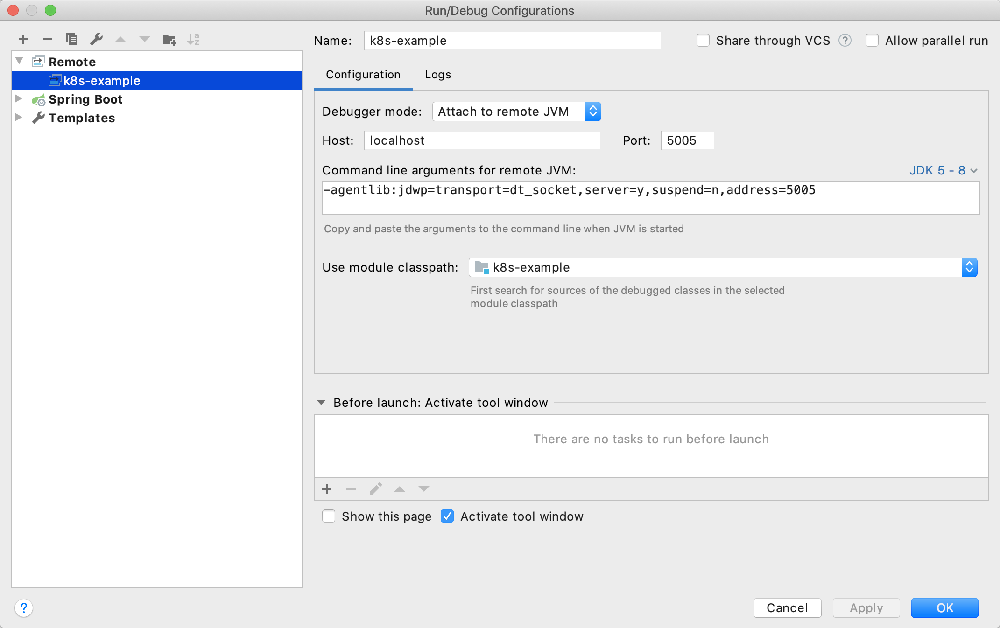
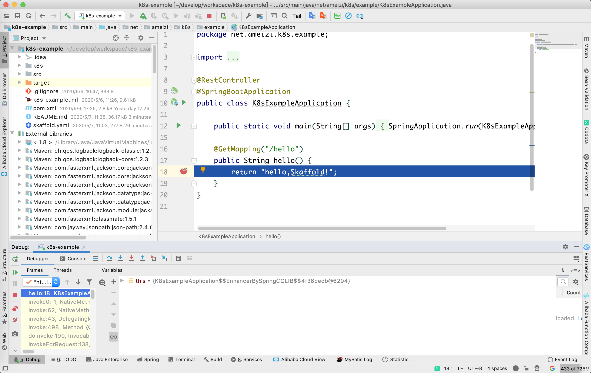

# k8s-example

### 使用`spring-boot-maven-plugin`构建

升级spring boot 版本为2.3.x，执行`spring-boot:build-image`命令即可。

```bash
$  mvn spring-boot:build-image
  [INFO] Scanning for projects...
  [INFO] 
  [INFO] -----------------------< net.ameizi:k8s-example >-----------------------
  [INFO] Building k8s-example 1.0.0
  [INFO] --------------------------------[ jar ]---------------------------------
  [INFO] 
  [INFO] >>> spring-boot-maven-plugin:2.3.0.BUILD-SNAPSHOT:build-image (default-cli) > package @ k8s-example >>>
  [INFO] 
  [INFO] --- maven-resources-plugin:3.1.0:resources (default-resources) @ k8s-example ---
  [INFO] Using 'UTF-8' encoding to copy filtered resources.
  [INFO] Copying 1 resource
  [INFO] Copying 0 resource
  [INFO] 
  [INFO] --- maven-compiler-plugin:3.8.1:compile (default-compile) @ k8s-example ---
  [INFO] Changes detected - recompiling the module!
  [INFO] Compiling 1 source file to /Users/amz/develop/workspace/k8s-example/target/classes
  [INFO] 
  [INFO] --- maven-resources-plugin:3.1.0:testResources (default-testResources) @ k8s-example ---
  [INFO] Using 'UTF-8' encoding to copy filtered resources.
  [INFO] skip non existing resourceDirectory /Users/amz/develop/workspace/k8s-example/src/test/resources
  [INFO] 
  [INFO] --- maven-compiler-plugin:3.8.1:testCompile (default-testCompile) @ k8s-example ---
  [INFO] Changes detected - recompiling the module!
  [INFO] Compiling 1 source file to /Users/amz/develop/workspace/k8s-example/target/test-classes
  [INFO] 
  [INFO] --- maven-surefire-plugin:2.22.2:test (default-test) @ k8s-example ---
  Downloading from spring-milestones: https://repo.spring.io/milestone/org/apache/maven/surefire/surefire-junit-platform/2.22.2/surefire-junit-platform-2.22.2.pom
  Downloading from spring-snapshots: https://repo.spring.io/snapshot/org/apache/maven/surefire/surefire-junit-platform/2.22.2/surefire-junit-platform-2.22.2.pom
  Downloading from central: https://repo.maven.apache.org/maven2/org/apache/maven/surefire/surefire-junit-platform/2.22.2/surefire-junit-platform-2.22.2.pom
  Downloaded from central: https://repo.maven.apache.org/maven2/org/apache/maven/surefire/surefire-junit-platform/2.22.2/surefire-junit-platform-2.22.2.pom (0 B at 0 B/s)
  Downloading from spring-milestones: https://repo.spring.io/milestone/org/apache/maven/surefire/surefire-providers/2.22.2/surefire-providers-2.22.2.pom
  Downloading from spring-snapshots: https://repo.spring.io/snapshot/org/apache/maven/surefire/surefire-providers/2.22.2/surefire-providers-2.22.2.pom
  Downloading from central: https://repo.maven.apache.org/maven2/org/apache/maven/surefire/surefire-providers/2.22.2/surefire-providers-2.22.2.pom
  Downloaded from central: https://repo.maven.apache.org/maven2/org/apache/maven/surefire/surefire-providers/2.22.2/surefire-providers-2.22.2.pom (0 B at 0 B/s)
  Downloading from spring-milestones: https://repo.spring.io/milestone/org/junit/platform/junit-platform-launcher/1.3.1/junit-platform-launcher-1.3.1.pom
  Downloading from spring-snapshots: https://repo.spring.io/snapshot/org/junit/platform/junit-platform-launcher/1.3.1/junit-platform-launcher-1.3.1.pom
  Downloading from central: https://repo.maven.apache.org/maven2/org/junit/platform/junit-platform-launcher/1.3.1/junit-platform-launcher-1.3.1.pom
  Downloaded from central: https://repo.maven.apache.org/maven2/org/junit/platform/junit-platform-launcher/1.3.1/junit-platform-launcher-1.3.1.pom (0 B at 0 B/s)
  Downloading from spring-milestones: https://repo.spring.io/milestone/org/apiguardian/apiguardian-api/1.0.0/apiguardian-api-1.0.0.pom
  Downloading from spring-snapshots: https://repo.spring.io/snapshot/org/apiguardian/apiguardian-api/1.0.0/apiguardian-api-1.0.0.pom
  Downloading from central: https://repo.maven.apache.org/maven2/org/apiguardian/apiguardian-api/1.0.0/apiguardian-api-1.0.0.pom
  Downloaded from central: https://repo.maven.apache.org/maven2/org/apiguardian/apiguardian-api/1.0.0/apiguardian-api-1.0.0.pom (0 B at 0 B/s)
  Downloading from spring-milestones: https://repo.spring.io/milestone/org/junit/platform/junit-platform-engine/1.3.1/junit-platform-engine-1.3.1.pom
  Downloading from spring-snapshots: https://repo.spring.io/snapshot/org/junit/platform/junit-platform-engine/1.3.1/junit-platform-engine-1.3.1.pom
  Downloading from central: https://repo.maven.apache.org/maven2/org/junit/platform/junit-platform-engine/1.3.1/junit-platform-engine-1.3.1.pom
  Downloaded from central: https://repo.maven.apache.org/maven2/org/junit/platform/junit-platform-engine/1.3.1/junit-platform-engine-1.3.1.pom (0 B at 0 B/s)
  Downloading from spring-milestones: https://repo.spring.io/milestone/org/junit/platform/junit-platform-commons/1.3.1/junit-platform-commons-1.3.1.pom
  Downloading from spring-snapshots: https://repo.spring.io/snapshot/org/junit/platform/junit-platform-commons/1.3.1/junit-platform-commons-1.3.1.pom
  Downloading from central: https://repo.maven.apache.org/maven2/org/junit/platform/junit-platform-commons/1.3.1/junit-platform-commons-1.3.1.pom
  Downloaded from central: https://repo.maven.apache.org/maven2/org/junit/platform/junit-platform-commons/1.3.1/junit-platform-commons-1.3.1.pom (0 B at 0 B/s)
  Downloading from spring-milestones: https://repo.spring.io/milestone/org/opentest4j/opentest4j/1.1.1/opentest4j-1.1.1.pom
  Downloading from spring-snapshots: https://repo.spring.io/snapshot/org/opentest4j/opentest4j/1.1.1/opentest4j-1.1.1.pom
  Downloading from central: https://repo.maven.apache.org/maven2/org/opentest4j/opentest4j/1.1.1/opentest4j-1.1.1.pom
  Downloaded from central: https://repo.maven.apache.org/maven2/org/opentest4j/opentest4j/1.1.1/opentest4j-1.1.1.pom (0 B at 0 B/s)
  Downloading from spring-milestones: https://repo.spring.io/milestone/org/apiguardian/apiguardian-api/1.0.0/apiguardian-api-1.0.0.jar
  Downloading from spring-milestones: https://repo.spring.io/milestone/org/junit/platform/junit-platform-launcher/1.3.1/junit-platform-launcher-1.3.1.jar
  Downloading from spring-milestones: https://repo.spring.io/milestone/org/junit/platform/junit-platform-commons/1.3.1/junit-platform-commons-1.3.1.jar
  Downloading from spring-milestones: https://repo.spring.io/milestone/org/apache/maven/surefire/surefire-junit-platform/2.22.2/surefire-junit-platform-2.22.2.jar
  Downloading from spring-milestones: https://repo.spring.io/milestone/org/junit/platform/junit-platform-engine/1.3.1/junit-platform-engine-1.3.1.jar
  Downloading from spring-snapshots: https://repo.spring.io/snapshot/org/apiguardian/apiguardian-api/1.0.0/apiguardian-api-1.0.0.jar
  Downloading from spring-snapshots: https://repo.spring.io/snapshot/org/junit/platform/junit-platform-engine/1.3.1/junit-platform-engine-1.3.1.jar
  Downloading from spring-snapshots: https://repo.spring.io/snapshot/org/junit/platform/junit-platform-launcher/1.3.1/junit-platform-launcher-1.3.1.jar
  Downloading from spring-snapshots: https://repo.spring.io/snapshot/org/junit/platform/junit-platform-commons/1.3.1/junit-platform-commons-1.3.1.jar
  Downloading from spring-snapshots: https://repo.spring.io/snapshot/org/apache/maven/surefire/surefire-junit-platform/2.22.2/surefire-junit-platform-2.22.2.jar
  Downloading from central: https://repo.maven.apache.org/maven2/org/apiguardian/apiguardian-api/1.0.0/apiguardian-api-1.0.0.jar
  Downloaded from central: https://repo.maven.apache.org/maven2/org/apiguardian/apiguardian-api/1.0.0/apiguardian-api-1.0.0.jar (0 B at 0 B/s)
  Downloading from spring-milestones: https://repo.spring.io/milestone/org/opentest4j/opentest4j/1.1.1/opentest4j-1.1.1.jar
  Downloading from central: https://repo.maven.apache.org/maven2/org/junit/platform/junit-platform-engine/1.3.1/junit-platform-engine-1.3.1.jar
  Downloading from central: https://repo.maven.apache.org/maven2/org/junit/platform/junit-platform-launcher/1.3.1/junit-platform-launcher-1.3.1.jar
  Downloading from central: https://repo.maven.apache.org/maven2/org/junit/platform/junit-platform-commons/1.3.1/junit-platform-commons-1.3.1.jar
  Downloading from central: https://repo.maven.apache.org/maven2/org/apache/maven/surefire/surefire-junit-platform/2.22.2/surefire-junit-platform-2.22.2.jar
  Downloaded from central: https://repo.maven.apache.org/maven2/org/junit/platform/junit-platform-engine/1.3.1/junit-platform-engine-1.3.1.jar (0 B at 0 B/s)
  Downloading from spring-snapshots: https://repo.spring.io/snapshot/org/opentest4j/opentest4j/1.1.1/opentest4j-1.1.1.jar
  Downloading from central: https://repo.maven.apache.org/maven2/org/opentest4j/opentest4j/1.1.1/opentest4j-1.1.1.jar
  Downloaded from central: https://repo.maven.apache.org/maven2/org/junit/platform/junit-platform-launcher/1.3.1/junit-platform-launcher-1.3.1.jar (0 B at 0 B/s)
  Downloaded from central: https://repo.maven.apache.org/maven2/org/apache/maven/surefire/surefire-junit-platform/2.22.2/surefire-junit-platform-2.22.2.jar (0 B at 0 B/s)
  Downloaded from central: https://repo.maven.apache.org/maven2/org/opentest4j/opentest4j/1.1.1/opentest4j-1.1.1.jar (0 B at 0 B/s)
  Downloaded from central: https://repo.maven.apache.org/maven2/org/junit/platform/junit-platform-commons/1.3.1/junit-platform-commons-1.3.1.jar (0 B at 0 B/s)
  [INFO] 
  [INFO] -------------------------------------------------------
  [INFO]  T E S T S
  [INFO] -------------------------------------------------------
  [INFO] Running net.ameizi.k8s.example.K8sExampleApplicationTests
  14:26:46.188 [main] DEBUG org.springframework.test.context.BootstrapUtils - Instantiating CacheAwareContextLoaderDelegate from class [org.springframework.test.context.cache.DefaultCacheAwareContextLoaderDelegate]
  14:26:46.206 [main] DEBUG org.springframework.test.context.BootstrapUtils - Instantiating BootstrapContext using constructor [public org.springframework.test.context.support.DefaultBootstrapContext(java.lang.Class,org.springframework.test.context.CacheAwareContextLoaderDelegate)]
  14:26:46.250 [main] DEBUG org.springframework.test.context.BootstrapUtils - Instantiating TestContextBootstrapper for test class [net.ameizi.k8s.example.K8sExampleApplicationTests] from class [org.springframework.boot.test.context.SpringBootTestContextBootstrapper]
  14:26:46.267 [main] INFO org.springframework.boot.test.context.SpringBootTestContextBootstrapper - Neither @ContextConfiguration nor @ContextHierarchy found for test class [net.ameizi.k8s.example.K8sExampleApplicationTests], using SpringBootContextLoader
  14:26:46.277 [main] DEBUG org.springframework.test.context.support.AbstractContextLoader - Did not detect default resource location for test class [net.ameizi.k8s.example.K8sExampleApplicationTests]: class path resource [net/ameizi/k8s/example/K8sExampleApplicationTests-context.xml] does not exist
  14:26:46.278 [main] DEBUG org.springframework.test.context.support.AbstractContextLoader - Did not detect default resource location for test class [net.ameizi.k8s.example.K8sExampleApplicationTests]: class path resource [net/ameizi/k8s/example/K8sExampleApplicationTestsContext.groovy] does not exist
  14:26:46.278 [main] INFO org.springframework.test.context.support.AbstractContextLoader - Could not detect default resource locations for test class [net.ameizi.k8s.example.K8sExampleApplicationTests]: no resource found for suffixes {-context.xml, Context.groovy}.
  14:26:46.279 [main] INFO org.springframework.test.context.support.AnnotationConfigContextLoaderUtils - Could not detect default configuration classes for test class [net.ameizi.k8s.example.K8sExampleApplicationTests]: K8sExampleApplicationTests does not declare any static, non-private, non-final, nested classes annotated with @Configuration.
  14:26:46.354 [main] DEBUG org.springframework.test.context.support.ActiveProfilesUtils - Could not find an 'annotation declaring class' for annotation type [org.springframework.test.context.ActiveProfiles] and class [net.ameizi.k8s.example.K8sExampleApplicationTests]
  14:26:46.457 [main] DEBUG org.springframework.context.annotation.ClassPathScanningCandidateComponentProvider - Identified candidate component class: file [/Users/amz/develop/workspace/k8s-example/target/classes/net/ameizi/k8s/example/K8sExampleApplication.class]
  14:26:46.458 [main] INFO org.springframework.boot.test.context.SpringBootTestContextBootstrapper - Found @SpringBootConfiguration net.ameizi.k8s.example.K8sExampleApplication for test class net.ameizi.k8s.example.K8sExampleApplicationTests
  14:26:46.580 [main] DEBUG org.springframework.boot.test.context.SpringBootTestContextBootstrapper - @TestExecutionListeners is not present for class [net.ameizi.k8s.example.K8sExampleApplicationTests]: using defaults.
  14:26:46.582 [main] INFO org.springframework.boot.test.context.SpringBootTestContextBootstrapper - Loaded default TestExecutionListener class names from location [META-INF/spring.factories]: [org.springframework.boot.test.mock.mockito.MockitoTestExecutionListener, org.springframework.boot.test.mock.mockito.ResetMocksTestExecutionListener, org.springframework.boot.test.autoconfigure.restdocs.RestDocsTestExecutionListener, org.springframework.boot.test.autoconfigure.web.client.MockRestServiceServerResetTestExecutionListener, org.springframework.boot.test.autoconfigure.web.servlet.MockMvcPrintOnlyOnFailureTestExecutionListener, org.springframework.boot.test.autoconfigure.web.servlet.WebDriverTestExecutionListener, org.springframework.test.context.web.ServletTestExecutionListener, org.springframework.test.context.support.DirtiesContextBeforeModesTestExecutionListener, org.springframework.test.context.support.DependencyInjectionTestExecutionListener, org.springframework.test.context.support.DirtiesContextTestExecutionListener, org.springframework.test.context.transaction.TransactionalTestExecutionListener, org.springframework.test.context.jdbc.SqlScriptsTestExecutionListener, org.springframework.test.context.event.EventPublishingTestExecutionListener]
  14:26:46.603 [main] DEBUG org.springframework.boot.test.context.SpringBootTestContextBootstrapper - Skipping candidate TestExecutionListener [org.springframework.test.context.transaction.TransactionalTestExecutionListener] due to a missing dependency. Specify custom listener classes or make the default listener classes and their required dependencies available. Offending class: [org/springframework/transaction/interceptor/TransactionAttributeSource]
  14:26:46.604 [main] DEBUG org.springframework.boot.test.context.SpringBootTestContextBootstrapper - Skipping candidate TestExecutionListener [org.springframework.test.context.jdbc.SqlScriptsTestExecutionListener] due to a missing dependency. Specify custom listener classes or make the default listener classes and their required dependencies available. Offending class: [org/springframework/transaction/interceptor/TransactionAttribute]
  14:26:46.605 [main] INFO org.springframework.boot.test.context.SpringBootTestContextBootstrapper - Using TestExecutionListeners: [org.springframework.test.context.web.ServletTestExecutionListener@1da2cb77, org.springframework.test.context.support.DirtiesContextBeforeModesTestExecutionListener@48f278eb, org.springframework.boot.test.mock.mockito.MockitoTestExecutionListener@2f217633, org.springframework.boot.test.autoconfigure.SpringBootDependencyInjectionTestExecutionListener@a530d0a, org.springframework.test.context.support.DirtiesContextTestExecutionListener@1a18644, org.springframework.test.context.event.EventPublishingTestExecutionListener@5acf93bb, org.springframework.boot.test.mock.mockito.ResetMocksTestExecutionListener@7e7be63f, org.springframework.boot.test.autoconfigure.restdocs.RestDocsTestExecutionListener@6cd28fa7, org.springframework.boot.test.autoconfigure.web.client.MockRestServiceServerResetTestExecutionListener@614ca7df, org.springframework.boot.test.autoconfigure.web.servlet.MockMvcPrintOnlyOnFailureTestExecutionListener@4738a206, org.springframework.boot.test.autoconfigure.web.servlet.WebDriverTestExecutionListener@66d3eec0]
  14:26:46.609 [main] DEBUG org.springframework.test.context.support.AbstractDirtiesContextTestExecutionListener - Before test class: context [DefaultTestContext@741a8937 testClass = K8sExampleApplicationTests, testInstance = [null], testMethod = [null], testException = [null], mergedContextConfiguration = [WebMergedContextConfiguration@306e95ec testClass = K8sExampleApplicationTests, locations = '{}', classes = '{class net.ameizi.k8s.example.K8sExampleApplication}', contextInitializerClasses = '[]', activeProfiles = '{}', propertySourceLocations = '{}', propertySourceProperties = '{org.springframework.boot.test.context.SpringBootTestContextBootstrapper=true}', contextCustomizers = set[org.springframework.boot.test.context.filter.ExcludeFilterContextCustomizer@2ddc8ecb, org.springframework.boot.test.json.DuplicateJsonObjectContextCustomizerFactory$DuplicateJsonObjectContextCustomizer@33afa13b, org.springframework.boot.test.mock.mockito.MockitoContextCustomizer@0, org.springframework.boot.test.web.client.TestRestTemplateContextCustomizer@5dd6264, org.springframework.boot.test.autoconfigure.properties.PropertyMappingContextCustomizer@0, org.springframework.boot.test.autoconfigure.web.servlet.WebDriverContextCustomizerFactory$Customizer@7c0c77c7, org.springframework.boot.test.context.SpringBootTestArgs@1], resourceBasePath = 'src/main/webapp', contextLoader = 'org.springframework.boot.test.context.SpringBootContextLoader', parent = [null]], attributes = map['org.springframework.test.context.web.ServletTestExecutionListener.activateListener' -> true]], class annotated with @DirtiesContext [false] with mode [null].
  14:26:46.654 [main] DEBUG org.springframework.test.context.support.TestPropertySourceUtils - Adding inlined properties to environment: {spring.jmx.enabled=false, org.springframework.boot.test.context.SpringBootTestContextBootstrapper=true}
  
    .   ____          _            __ _ _
   /\\ / ___'_ __ _ _(_)_ __  __ _ \ \ \ \
  ( ( )\___ | '_ | '_| | '_ \/ _` | \ \ \ \
   \\/  ___)| |_)| | | | | || (_| |  ) ) ) )
    '  |____| .__|_| |_|_| |_\__, | / / / /
   =========|_|==============|___/=/_/_/_/
   :: Spring Boot ::  (v2.3.0.BUILD-SNAPSHOT)
  
  2020-05-07 14:26:47.064  INFO 44321 --- [           main] n.a.k.e.K8sExampleApplicationTests       : Starting K8sExampleApplicationTests on swfeng.local with PID 44321 (started by amz in /Users/amz/develop/workspace/k8s-example)
  2020-05-07 14:26:47.066  INFO 44321 --- [           main] n.a.k.e.K8sExampleApplicationTests       : No active profile set, falling back to default profiles: default
  2020-05-07 14:26:48.913  INFO 44321 --- [           main] o.s.s.concurrent.ThreadPoolTaskExecutor  : Initializing ExecutorService 'applicationTaskExecutor'
  2020-05-07 14:26:49.506  INFO 44321 --- [           main] o.s.b.a.e.web.EndpointLinksResolver      : Exposing 13 endpoint(s) beneath base path '/actuator'
  2020-05-07 14:26:49.595  INFO 44321 --- [           main] n.a.k.e.K8sExampleApplicationTests       : Started K8sExampleApplicationTests in 2.92 seconds (JVM running for 4.057)
  [INFO] Tests run: 1, Failures: 0, Errors: 0, Skipped: 0, Time elapsed: 3.872 s - in net.ameizi.k8s.example.K8sExampleApplicationTests
  2020-05-07 14:26:49.969  INFO 44321 --- [extShutdownHook] o.s.s.concurrent.ThreadPoolTaskExecutor  : Shutting down ExecutorService 'applicationTaskExecutor'
  [INFO] 
  [INFO] Results:
  [INFO] 
  [INFO] Tests run: 1, Failures: 0, Errors: 0, Skipped: 0
  [INFO] 
  [INFO] 
  [INFO] --- maven-jar-plugin:3.2.0:jar (default-jar) @ k8s-example ---
  [INFO] Building jar: /Users/amz/develop/workspace/k8s-example/target/k8s-example-1.0.0.jar
  [INFO] 
  [INFO] --- spring-boot-maven-plugin:2.3.0.BUILD-SNAPSHOT:repackage (repackage) @ k8s-example ---
  [INFO] Replacing main artifact with repackaged archive
  [INFO] 
  [INFO] --- jib-maven-plugin:2.2.0:build (default) @ k8s-example ---
  [INFO] 
  [INFO] Containerizing application to registry.hub.docker.com/aimeizi/k8s-example...
  [WARNING] Base image 'openjdk:8-jdk-alpine' does not use a specific image digest - build may not be reproducible
  [INFO] Using credentials from Docker config (/Users/amz/.docker/config.json) for registry.hub.docker.com/aimeizi/k8s-example
  [INFO] The base image requires auth. Trying again for openjdk:8-jdk-alpine...
  [WARNING] The credential helper (docker-credential-desktop) has nothing for server URL: registry-1.docker.ioNG] 
  
  Got output:
  
  credentials not found in native keychain
  
  [INFO] Using credentials from Docker config (/Users/amz/.docker/config.json) for openjdk:8-jdk-alpine
  [INFO] Using base image with digest: sha256:44b3cea369c947527e266275cee85c71a81f20fc5076f6ebb5a13f19015dce71 
  [INFO] 
  [INFO] Container entrypoint set to [java, -cp, /app/resources:/app/classes:/app/libs/*, net.ameizi.k8s.example.K8sExampleApplication]
  [INFO] 
  [INFO] Built and pushed image as registry.hub.docker.com/aimeizi/k8s-example
  [INFO] Executing tasks:
  [INFO] [===========================   ] 88.9% complete
  [INFO] > launching layer pushers
  [INFO] 
  [INFO] 
  [INFO] <<< spring-boot-maven-plugin:2.3.0.BUILD-SNAPSHOT:build-image (default-cli) < package @ k8s-example <<<
  [INFO] 
  [INFO] 
  [INFO] --- spring-boot-maven-plugin:2.3.0.BUILD-SNAPSHOT:build-image (default-cli) @ k8s-example ---
  [INFO] Building image 'docker.io/library/k8s-example:1.0.0'
  [INFO] 
  [INFO]  > Pulling builder image 'gcr.io/paketo-buildpacks/builder:base-platform-api-0.3' 0%
  [INFO]  > Pulling builder image 'gcr.io/paketo-buildpacks/builder:base-platform-api-0.3' 2%
  [INFO]  > Pulling builder image 'gcr.io/paketo-buildpacks/builder:base-platform-api-0.3' 2%
  [INFO]  > Pulling builder image 'gcr.io/paketo-buildpacks/builder:base-platform-api-0.3' 2%
  [INFO]  > Pulling builder image 'gcr.io/paketo-buildpacks/builder:base-platform-api-0.3' 3%
  [INFO]  > Pulling builder image 'gcr.io/paketo-buildpacks/builder:base-platform-api-0.3' 3%
  [INFO]  > Pulling builder image 'gcr.io/paketo-buildpacks/builder:base-platform-api-0.3' 4%
  [INFO]  > Pulling builder image 'gcr.io/paketo-buildpacks/builder:base-platform-api-0.3' 4%
  [INFO]  > Pulling builder image 'gcr.io/paketo-buildpacks/builder:base-platform-api-0.3' 6%
  [INFO]  > Pulling builder image 'gcr.io/paketo-buildpacks/builder:base-platform-api-0.3' 7%
  [INFO]  > Pulling builder image 'gcr.io/paketo-buildpacks/builder:base-platform-api-0.3' 7%
  [INFO]  > Pulling builder image 'gcr.io/paketo-buildpacks/builder:base-platform-api-0.3' 8%
  [INFO]  > Pulling builder image 'gcr.io/paketo-buildpacks/builder:base-platform-api-0.3' 8%
  [INFO]  > Pulling builder image 'gcr.io/paketo-buildpacks/builder:base-platform-api-0.3' 10%
  [INFO]  > Pulling builder image 'gcr.io/paketo-buildpacks/builder:base-platform-api-0.3' 11%
  [INFO]  > Pulling builder image 'gcr.io/paketo-buildpacks/builder:base-platform-api-0.3' 11%
  [INFO]  > Pulling builder image 'gcr.io/paketo-buildpacks/builder:base-platform-api-0.3' 12%
  [INFO]  > Pulling builder image 'gcr.io/paketo-buildpacks/builder:base-platform-api-0.3' 12%
  [INFO]  > Pulling builder image 'gcr.io/paketo-buildpacks/builder:base-platform-api-0.3' 12%
  [INFO]  > Pulling builder image 'gcr.io/paketo-buildpacks/builder:base-platform-api-0.3' 13%
  [INFO]  > Pulling builder image 'gcr.io/paketo-buildpacks/builder:base-platform-api-0.3' 13%
  [INFO]  > Pulling builder image 'gcr.io/paketo-buildpacks/builder:base-platform-api-0.3' 13%
  [INFO]  > Pulling builder image 'gcr.io/paketo-buildpacks/builder:base-platform-api-0.3' 14%
  [INFO]  > Pulling builder image 'gcr.io/paketo-buildpacks/builder:base-platform-api-0.3' 14%
  [INFO]  > Pulling builder image 'gcr.io/paketo-buildpacks/builder:base-platform-api-0.3' 14%
  [INFO]  > Pulling builder image 'gcr.io/paketo-buildpacks/builder:base-platform-api-0.3' 14%
  [INFO]  > Pulling builder image 'gcr.io/paketo-buildpacks/builder:base-platform-api-0.3' 14%
  [INFO]  > Pulling builder image 'gcr.io/paketo-buildpacks/builder:base-platform-api-0.3' 14%
  [INFO]  > Pulling builder image 'gcr.io/paketo-buildpacks/builder:base-platform-api-0.3' 14%
  [INFO]  > Pulling builder image 'gcr.io/paketo-buildpacks/builder:base-platform-api-0.3' 15%
  [INFO]  > Pulling builder image 'gcr.io/paketo-buildpacks/builder:base-platform-api-0.3' 16%
  [INFO]  > Pulling builder image 'gcr.io/paketo-buildpacks/builder:base-platform-api-0.3' 20%
  [INFO]  > Pulling builder image 'gcr.io/paketo-buildpacks/builder:base-platform-api-0.3' 20%
  [INFO]  > Pulling builder image 'gcr.io/paketo-buildpacks/builder:base-platform-api-0.3' 21%
  [INFO]  > Pulling builder image 'gcr.io/paketo-buildpacks/builder:base-platform-api-0.3' 21%
  [INFO]  > Pulling builder image 'gcr.io/paketo-buildpacks/builder:base-platform-api-0.3' 22%
  [INFO]  > Pulling builder image 'gcr.io/paketo-buildpacks/builder:base-platform-api-0.3' 22%
  [INFO]  > Pulling builder image 'gcr.io/paketo-buildpacks/builder:base-platform-api-0.3' 23%
  [INFO]  > Pulling builder image 'gcr.io/paketo-buildpacks/builder:base-platform-api-0.3' 23%
  [INFO]  > Pulling builder image 'gcr.io/paketo-buildpacks/builder:base-platform-api-0.3' 23%
  [INFO]  > Pulling builder image 'gcr.io/paketo-buildpacks/builder:base-platform-api-0.3' 24%
  [INFO]  > Pulling builder image 'gcr.io/paketo-buildpacks/builder:base-platform-api-0.3' 24%
  [INFO]  > Pulling builder image 'gcr.io/paketo-buildpacks/builder:base-platform-api-0.3' 24%
  [INFO]  > Pulling builder image 'gcr.io/paketo-buildpacks/builder:base-platform-api-0.3' 25%
  [INFO]  > Pulling builder image 'gcr.io/paketo-buildpacks/builder:base-platform-api-0.3' 25%
  [INFO]  > Pulling builder image 'gcr.io/paketo-buildpacks/builder:base-platform-api-0.3' 25%
  [INFO]  > Pulling builder image 'gcr.io/paketo-buildpacks/builder:base-platform-api-0.3' 26%
  [INFO]  > Pulling builder image 'gcr.io/paketo-buildpacks/builder:base-platform-api-0.3' 26%
  [INFO]  > Pulling builder image 'gcr.io/paketo-buildpacks/builder:base-platform-api-0.3' 27%
  [INFO]  > Pulling builder image 'gcr.io/paketo-buildpacks/builder:base-platform-api-0.3' 27%
  [INFO]  > Pulling builder image 'gcr.io/paketo-buildpacks/builder:base-platform-api-0.3' 27%
  [INFO]  > Pulling builder image 'gcr.io/paketo-buildpacks/builder:base-platform-api-0.3' 28%
  [INFO]  > Pulling builder image 'gcr.io/paketo-buildpacks/builder:base-platform-api-0.3' 28%
  [INFO]  > Pulling builder image 'gcr.io/paketo-buildpacks/builder:base-platform-api-0.3' 29%
  [INFO]  > Pulling builder image 'gcr.io/paketo-buildpacks/builder:base-platform-api-0.3' 30%
  [INFO]  > Pulling builder image 'gcr.io/paketo-buildpacks/builder:base-platform-api-0.3' 30%
  [INFO]  > Pulling builder image 'gcr.io/paketo-buildpacks/builder:base-platform-api-0.3' 31%
  [INFO]  > Pulling builder image 'gcr.io/paketo-buildpacks/builder:base-platform-api-0.3' 31%
  [INFO]  > Pulling builder image 'gcr.io/paketo-buildpacks/builder:base-platform-api-0.3' 31%
  [INFO]  > Pulling builder image 'gcr.io/paketo-buildpacks/builder:base-platform-api-0.3' 32%
  [INFO]  > Pulling builder image 'gcr.io/paketo-buildpacks/builder:base-platform-api-0.3' 32%
  [INFO]  > Pulling builder image 'gcr.io/paketo-buildpacks/builder:base-platform-api-0.3' 32%
  [INFO]  > Pulling builder image 'gcr.io/paketo-buildpacks/builder:base-platform-api-0.3' 32%
  [INFO]  > Pulling builder image 'gcr.io/paketo-buildpacks/builder:base-platform-api-0.3' 32%
  [INFO]  > Pulling builder image 'gcr.io/paketo-buildpacks/builder:base-platform-api-0.3' 33%
  [INFO]  > Pulling builder image 'gcr.io/paketo-buildpacks/builder:base-platform-api-0.3' 33%
  [INFO]  > Pulling builder image 'gcr.io/paketo-buildpacks/builder:base-platform-api-0.3' 33%
  [INFO]  > Pulling builder image 'gcr.io/paketo-buildpacks/builder:base-platform-api-0.3' 33%
  [INFO]  > Pulling builder image 'gcr.io/paketo-buildpacks/builder:base-platform-api-0.3' 33%
  [INFO]  > Pulling builder image 'gcr.io/paketo-buildpacks/builder:base-platform-api-0.3' 34%
  [INFO]  > Pulling builder image 'gcr.io/paketo-buildpacks/builder:base-platform-api-0.3' 34%
  [INFO]  > Pulling builder image 'gcr.io/paketo-buildpacks/builder:base-platform-api-0.3' 34%
  [INFO]  > Pulling builder image 'gcr.io/paketo-buildpacks/builder:base-platform-api-0.3' 34%
  [INFO]  > Pulling builder image 'gcr.io/paketo-buildpacks/builder:base-platform-api-0.3' 34%
  [INFO]  > Pulling builder image 'gcr.io/paketo-buildpacks/builder:base-platform-api-0.3' 35%
  [INFO]  > Pulling builder image 'gcr.io/paketo-buildpacks/builder:base-platform-api-0.3' 35%
  [INFO]  > Pulling builder image 'gcr.io/paketo-buildpacks/builder:base-platform-api-0.3' 35%
  [INFO]  > Pulling builder image 'gcr.io/paketo-buildpacks/builder:base-platform-api-0.3' 36%
  [INFO]  > Pulling builder image 'gcr.io/paketo-buildpacks/builder:base-platform-api-0.3' 36%
  [INFO]  > Pulling builder image 'gcr.io/paketo-buildpacks/builder:base-platform-api-0.3' 37%
  [INFO]  > Pulling builder image 'gcr.io/paketo-buildpacks/builder:base-platform-api-0.3' 37%
  [INFO]  > Pulling builder image 'gcr.io/paketo-buildpacks/builder:base-platform-api-0.3' 37%
  [INFO]  > Pulling builder image 'gcr.io/paketo-buildpacks/builder:base-platform-api-0.3' 38%
  [INFO]  > Pulling builder image 'gcr.io/paketo-buildpacks/builder:base-platform-api-0.3' 39%
  [INFO]  > Pulling builder image 'gcr.io/paketo-buildpacks/builder:base-platform-api-0.3' 48%
  [INFO]  > Pulling builder image 'gcr.io/paketo-buildpacks/builder:base-platform-api-0.3' 52%
  [INFO]  > Pulling builder image 'gcr.io/paketo-buildpacks/builder:base-platform-api-0.3' 54%
  [INFO]  > Pulling builder image 'gcr.io/paketo-buildpacks/builder:base-platform-api-0.3' 59%
  [INFO]  > Pulling builder image 'gcr.io/paketo-buildpacks/builder:base-platform-api-0.3' 63%
  [INFO]  > Pulling builder image 'gcr.io/paketo-buildpacks/builder:base-platform-api-0.3' 65%
  [INFO]  > Pulling builder image 'gcr.io/paketo-buildpacks/builder:base-platform-api-0.3' 67%
  [INFO]  > Pulling builder image 'gcr.io/paketo-buildpacks/builder:base-platform-api-0.3' 69%
  [INFO]  > Pulling builder image 'gcr.io/paketo-buildpacks/builder:base-platform-api-0.3' 69%
  [INFO]  > Pulling builder image 'gcr.io/paketo-buildpacks/builder:base-platform-api-0.3' 69%
  [INFO]  > Pulling builder image 'gcr.io/paketo-buildpacks/builder:base-platform-api-0.3' 70%
  [INFO]  > Pulling builder image 'gcr.io/paketo-buildpacks/builder:base-platform-api-0.3' 72%
  [INFO]  > Pulling builder image 'gcr.io/paketo-buildpacks/builder:base-platform-api-0.3' 72%
  [INFO]  > Pulling builder image 'gcr.io/paketo-buildpacks/builder:base-platform-api-0.3' 73%
  [INFO]  > Pulling builder image 'gcr.io/paketo-buildpacks/builder:base-platform-api-0.3' 73%
  [INFO]  > Pulling builder image 'gcr.io/paketo-buildpacks/builder:base-platform-api-0.3' 73%
  [INFO]  > Pulling builder image 'gcr.io/paketo-buildpacks/builder:base-platform-api-0.3' 74%
  [INFO]  > Pulling builder image 'gcr.io/paketo-buildpacks/builder:base-platform-api-0.3' 74%
  [INFO]  > Pulling builder image 'gcr.io/paketo-buildpacks/builder:base-platform-api-0.3' 74%
  [INFO]  > Pulling builder image 'gcr.io/paketo-buildpacks/builder:base-platform-api-0.3' 75%
  [INFO]  > Pulling builder image 'gcr.io/paketo-buildpacks/builder:base-platform-api-0.3' 77%
  [INFO]  > Pulling builder image 'gcr.io/paketo-buildpacks/builder:base-platform-api-0.3' 79%
  [INFO]  > Pulling builder image 'gcr.io/paketo-buildpacks/builder:base-platform-api-0.3' 79%
  [INFO]  > Pulling builder image 'gcr.io/paketo-buildpacks/builder:base-platform-api-0.3' 80%
  [INFO]  > Pulling builder image 'gcr.io/paketo-buildpacks/builder:base-platform-api-0.3' 80%
  [INFO]  > Pulling builder image 'gcr.io/paketo-buildpacks/builder:base-platform-api-0.3' 81%
  [INFO]  > Pulling builder image 'gcr.io/paketo-buildpacks/builder:base-platform-api-0.3' 81%
  [INFO]  > Pulling builder image 'gcr.io/paketo-buildpacks/builder:base-platform-api-0.3' 81%
  [INFO]  > Pulling builder image 'gcr.io/paketo-buildpacks/builder:base-platform-api-0.3' 81%
  [INFO]  > Pulling builder image 'gcr.io/paketo-buildpacks/builder:base-platform-api-0.3' 83%
  [INFO]  > Pulling builder image 'gcr.io/paketo-buildpacks/builder:base-platform-api-0.3' 87%
  [INFO]  > Pulling builder image 'gcr.io/paketo-buildpacks/builder:base-platform-api-0.3' 89%
  [INFO]  > Pulling builder image 'gcr.io/paketo-buildpacks/builder:base-platform-api-0.3' 89%
  [INFO]  > Pulling builder image 'gcr.io/paketo-buildpacks/builder:base-platform-api-0.3' 90%
  [INFO]  > Pulling builder image 'gcr.io/paketo-buildpacks/builder:base-platform-api-0.3' 90%
  [INFO]  > Pulling builder image 'gcr.io/paketo-buildpacks/builder:base-platform-api-0.3' 90%
  [INFO]  > Pulling builder image 'gcr.io/paketo-buildpacks/builder:base-platform-api-0.3' 90%
  [INFO]  > Pulling builder image 'gcr.io/paketo-buildpacks/builder:base-platform-api-0.3' 91%
  [INFO]  > Pulling builder image 'gcr.io/paketo-buildpacks/builder:base-platform-api-0.3' 91%
  [INFO]  > Pulling builder image 'gcr.io/paketo-buildpacks/builder:base-platform-api-0.3' 91%
  [INFO]  > Pulling builder image 'gcr.io/paketo-buildpacks/builder:base-platform-api-0.3' 91%
  [INFO]  > Pulling builder image 'gcr.io/paketo-buildpacks/builder:base-platform-api-0.3' 100%
  [INFO]  > Pulled builder image 'gcr.io/paketo-buildpacks/builder@sha256:1bb775a178ed4c54246ab71f323d2a5af0e4b70c83b0dc84f974694b0221d636'
  [INFO]  > Pulling run image 'gcr.io/paketo-buildpacks/run:base-cnb' 3%
  [INFO]  > Pulling run image 'gcr.io/paketo-buildpacks/run:base-cnb' 21%
  [INFO]  > Pulling run image 'gcr.io/paketo-buildpacks/run:base-cnb' 32%
  [INFO]  > Pulling run image 'gcr.io/paketo-buildpacks/run:base-cnb' 35%
  [INFO]  > Pulling run image 'gcr.io/paketo-buildpacks/run:base-cnb' 37%
  [INFO]  > Pulling run image 'gcr.io/paketo-buildpacks/run:base-cnb' 37%
  [INFO]  > Pulling run image 'gcr.io/paketo-buildpacks/run:base-cnb' 38%
  [INFO]  > Pulling run image 'gcr.io/paketo-buildpacks/run:base-cnb' 38%
  [INFO]  > Pulling run image 'gcr.io/paketo-buildpacks/run:base-cnb' 38%
  [INFO]  > Pulling run image 'gcr.io/paketo-buildpacks/run:base-cnb' 39%
  [INFO]  > Pulling run image 'gcr.io/paketo-buildpacks/run:base-cnb' 39%
  [INFO]  > Pulling run image 'gcr.io/paketo-buildpacks/run:base-cnb' 39%
  [INFO]  > Pulling run image 'gcr.io/paketo-buildpacks/run:base-cnb' 40%
  [INFO]  > Pulling run image 'gcr.io/paketo-buildpacks/run:base-cnb' 40%
  [INFO]  > Pulling run image 'gcr.io/paketo-buildpacks/run:base-cnb' 40%
  [INFO]  > Pulling run image 'gcr.io/paketo-buildpacks/run:base-cnb' 40%
  [INFO]  > Pulling run image 'gcr.io/paketo-buildpacks/run:base-cnb' 40%
  [INFO]  > Pulling run image 'gcr.io/paketo-buildpacks/run:base-cnb' 41%
  [INFO]  > Pulling run image 'gcr.io/paketo-buildpacks/run:base-cnb' 41%
  [INFO]  > Pulling run image 'gcr.io/paketo-buildpacks/run:base-cnb' 41%
  [INFO]  > Pulling run image 'gcr.io/paketo-buildpacks/run:base-cnb' 42%
  [INFO]  > Pulling run image 'gcr.io/paketo-buildpacks/run:base-cnb' 42%
  [INFO]  > Pulling run image 'gcr.io/paketo-buildpacks/run:base-cnb' 46%
  [INFO]  > Pulling run image 'gcr.io/paketo-buildpacks/run:base-cnb' 100%
  [INFO]  > Pulled run image 'gcr.io/paketo-buildpacks/run@sha256:d70bf0fe11d84277997c4a7da94b2867a90d6c0f55add4e19b7c565d5087206f'
  [INFO]  > Executing lifecycle version v0.7.4
  [INFO]  > Using build cache volume 'pack-cache-55330c9f9824.build'
  [INFO] 
  [INFO]  > Running detector
  [INFO]     [detector]    5 of 15 buildpacks participating
  [INFO]     [detector]    paketo-buildpacks/bellsoft-liberica 2.5.0
  [INFO]     [detector]    paketo-buildpacks/executable-jar    1.2.2
  [INFO]     [detector]    paketo-buildpacks/apache-tomcat     1.1.2
  [INFO]     [detector]    paketo-buildpacks/dist-zip          1.2.2
  [INFO]     [detector]    paketo-buildpacks/spring-boot       1.5.2
  [INFO] 
  [INFO]  > Running analyzer
  [INFO]     [analyzer]    Previous image with name "docker.io/library/k8s-example:1.0.0" not found
  [INFO] 
  [INFO]  > Running restorer
  [INFO] 
  [INFO]  > Running builder
  [INFO]     [builder]     
  [INFO]     [builder]     Paketo BellSoft Liberica Buildpack 2.5.0
  [INFO]     [builder]         Set $BP_JAVA_VERSION to configure the Java version. Default 11.*.
  [INFO]     [builder]         Set $BPL_HEAD_ROOM to configure the headroom in memory calculation. Default 0.
  [INFO]     [builder]         Set $BPL_LOADED_CLASS_COUNT to configure the number of loaded classes in memory calculation. Default 35% of classes.
  [INFO]     [builder]         Set $BPL_THREAD_COUNT to configure the number of threads in memory calculation. Default 250.
  [INFO]     [builder]       BellSoft Liberica JRE 8.0.252: Contributing to layer
  [INFO]     [builder]         Downloading from https://github.com/bell-sw/Liberica/releases/download/8u252+9/bellsoft-jre8u252+9-linux-amd64.tar.gz
  [INFO]     [builder]         Verifying checksum
  [INFO]     [builder]         Expanding to /layers/paketo-buildpacks_bellsoft-liberica/jre
  [INFO]     [builder]         Writing env.launch/JAVA_HOME.override
  [INFO]     [builder]         Writing env.launch/MALLOC_ARENA_MAX.override
  [INFO]     [builder]         Writing profile.d/active-processor-count.sh
  [INFO]     [builder]       Memory Calculator 4.0.0: Contributing to layer
  [INFO]     [builder]         Downloading from https://github.com/cloudfoundry/java-buildpack-memory-calculator/releases/download/v4.0.0/memory-calculator-4.0.0.tgz
  [INFO]     [builder]         Verifying checksum
  [INFO]     [builder]         Expanding to /layers/paketo-buildpacks_bellsoft-liberica/memory-calculator
  [INFO]     [builder]         Writing profile.d/memory-calculator.sh
  [INFO]     [builder]       Class Counter: Contributing to layer
  [INFO]     [builder]         Copying to /layers/paketo-buildpacks_bellsoft-liberica/class-counter
  [INFO]     [builder]       JVMKill Agent 1.16.0: Contributing to layer
  [INFO]     [builder]         Downloading from https://github.com/cloudfoundry/jvmkill/releases/download/v1.16.0.RELEASE/jvmkill-1.16.0-RELEASE.so
  [INFO]     [builder]         Verifying checksum
  [INFO]     [builder]         Copying to /layers/paketo-buildpacks_bellsoft-liberica/jvmkill
  [INFO]     [builder]         Writing env.launch/JAVA_OPTS.append
  [INFO]     [builder]       Link-Local DNS: Contributing to layer
  [INFO]     [builder]         Copying to /layers/paketo-buildpacks_bellsoft-liberica/link-local-dns
  [INFO]     [builder]         Writing profile.d/link-local-dns.sh
  [INFO]     [builder]       Java Security Properties: Contributing to layer
  [INFO]     [builder]         Writing env.launch/JAVA_OPTS.append
  [INFO]     [builder]         Writing env.launch/JAVA_SECURITY_PROPERTIES.override
  [INFO]     [builder]       Security Providers Configurer: Contributing to layer
  [INFO]     [builder]         Copying to /layers/paketo-buildpacks_bellsoft-liberica/security-providers-configurer
  [INFO]     [builder]         Writing profile.d/security-providers-classpath.sh
  [INFO]     [builder]         Writing profile.d/security-providers-configurer.sh
  [INFO]     [builder]       OpenSSL Security Provider 1.0.2: Contributing to layer
  [INFO]     [builder]         Downloading from https://jitpack.io/com/github/paketo-buildpacks/openssl-security-provider/1.0.2/openssl-security-provider-1.0.2.jar
  [INFO]     [builder]         Verifying checksum
  [INFO]     [builder]         Copying to /layers/paketo-buildpacks_bellsoft-liberica/openssl-security-provider
  [INFO]     [builder]         Writing env.launch/SECURITY_PROVIDERS.append
  [INFO]     [builder]         Writing env.launch/SECURITY_PROVIDERS_CLASSPATH
  [INFO]     [builder]         Writing profile.d/openssl-security-provider.sh
  [INFO]     [builder]     
  [INFO]     [builder]     Paketo Executable JAR Buildpack 1.2.2
  [INFO]     [builder]         Writing env/CLASSPATH
  [INFO]     [builder]       Process types:
  [INFO]     [builder]         executable-jar: java -cp "${CLASSPATH}" ${JAVA_OPTS} org.springframework.boot.loader.JarLauncher
  [INFO]     [builder]         task:           java -cp "${CLASSPATH}" ${JAVA_OPTS} org.springframework.boot.loader.JarLauncher
  [INFO]     [builder]         web:            java -cp "${CLASSPATH}" ${JAVA_OPTS} org.springframework.boot.loader.JarLauncher
  [INFO]     [builder]     
  [INFO]     [builder]     Paketo Spring Boot Buildpack 1.5.2
  [INFO]     [builder]       Image labels:
  [INFO]     [builder]         org.opencontainers.image.title
  [INFO]     [builder]         org.opencontainers.image.version
  [INFO]     [builder]         org.springframework.boot.spring-configuration-metadata.json
  [INFO]     [builder]         org.springframework.boot.version
  [INFO] 
  [INFO]  > Running exporter
  [INFO]     [exporter]    Adding layer 'launcher'
  [INFO]     [exporter]    Adding layer 'paketo-buildpacks/bellsoft-liberica:class-counter'
  [INFO]     [exporter]    Adding layer 'paketo-buildpacks/bellsoft-liberica:java-security-properties'
  [INFO]     [exporter]    Adding layer 'paketo-buildpacks/bellsoft-liberica:jre'
  [INFO]     [exporter]    Adding layer 'paketo-buildpacks/bellsoft-liberica:jvmkill'
  [INFO]     [exporter]    Adding layer 'paketo-buildpacks/bellsoft-liberica:link-local-dns'
  [INFO]     [exporter]    Adding layer 'paketo-buildpacks/bellsoft-liberica:memory-calculator'
  [INFO]     [exporter]    Adding layer 'paketo-buildpacks/bellsoft-liberica:openssl-security-provider'
  [INFO]     [exporter]    Adding layer 'paketo-buildpacks/bellsoft-liberica:security-providers-configurer'
  [INFO]     [exporter]    Adding layer 'paketo-buildpacks/executable-jar:class-path'
  [INFO]     [exporter]    Adding 1/1 app layer(s)
  [INFO]     [exporter]    Adding layer 'config'
  [INFO]     [exporter]    *** Images (39ca89c37d5b):
  [INFO]     [exporter]          docker.io/library/k8s-example:1.0.0
  [INFO]     [exporter]    Adding cache layer 'paketo-buildpacks/executable-jar:class-path'
  [INFO] 
  [INFO] Successfully built image 'docker.io/library/k8s-example:1.0.0'
  [INFO] 
  [INFO] ------------------------------------------------------------------------
  [INFO] BUILD SUCCESS
  [INFO] ------------------------------------------------------------------------
  [INFO] Total time:  08:13 min
  [INFO] Finished at: 2020-05-07T14:34:48+08:00
  [INFO] ------------------------------------------------------------------------
```
根据日志输出发现构建好的镜像默认为`docker.io/library/k8s-example:1.0.0`。当然这个可以配置修改

```xml
<plugin>
    <groupId>org.springframework.boot</groupId>
    <artifactId>spring-boot-maven-plugin</artifactId>
    <configuration>
        <image>
            <name>k8s-example:latest</name>
        </image>
    </configuration>
</plugin>
```

### 使用`jib-maven-plugin`插件构建 `docker` 镜像

```xml
<plugin>
    <groupId>com.google.cloud.tools</groupId>
    <artifactId>jib-maven-plugin</artifactId>
    <version>2.2.0</version>
    <executions>
        <execution>
            <phase>package</phase>
            <goals>
                <goal>build</goal>
            </goals>
        </execution>
    </executions>
    <configuration>
        <from>
            <image>openjdk:8-jdk-alpine</image>
        </from>
        <to>
            <!-- 坑!!!这里切记一定要设置 docker registry的完整地址，否则会被坑死，构建的时候会报授权错误，原因在于执行 mvn package 命令后会打包构建镜像并进行推送，因此要设置镜像仓库的地址，并且记得在命令行进行镜像仓库登录(docker login) -->
            <!-- 此处构建不依赖docker daemon进程。说人话就是不需要启动docker服务 -->
            <image>registry.hub.docker.com/aimeizi/k8s-example:latest</image>
        </to>
        <container>
            <mainClass>net.ameizi.k8s.example.K8sExampleApplication</mainClass>
            <ports>
                <port>8080</port>
            </ports>
        </container>
    </configuration>
</plugin>
```

执行构建

[](https://asciinema.org/a/Esgs9ePRSWqwYAGjD8CI84Lne)

### Kubernetes

导出 Deployment

```bash
$ mkdir k8s
$ kubectl create deployment k8s-example --image registry.hub.docker.com/aimeizi/k8s-example:latest -o yaml --dry-run > k8s/deployment.yaml
```

生成的deployment.yaml如下所示:

```yaml
apiVersion: apps/v1
kind: Deployment
metadata:
  creationTimestamp: null
  labels:
    app: k8s-example
  name: k8s-example
spec:
  replicas: 1
  selector:
    matchLabels:
      app: k8s-example
  strategy: {}
  template:
    metadata:
      creationTimestamp: null
      labels:
        app: k8s-example
    spec:
      containers:
      - image: registry.hub.docker.com/aimeizi/k8s-example:latest
        name: k8s-example
        resources: {}
status: {}
```

导出 Service

* ClusterIP方式

```bash
$ kubectl create service clusterip k8s-example --tcp 80:8080 -o yaml --dry-run > k8s/service.yaml
```
其中`80:8080`，80为宿主机端口，8080为容器内应用端口

生成的service.yaml如下所示:
```yaml
apiVersion: v1
kind: Service
metadata:
  creationTimestamp: null
  labels:
    app: k8s-example
  name: k8s-example
spec:
  ports:
  - name: 80-8080
    port: 80
    protocol: TCP
    targetPort: 8080
  selector:
    app: k8s-example
  type: ClusterIP # ClusterIP 需要 kubectl port-forward
status:
  loadBalancer: {}
```

应用和部署生成的Deployment、Service文件

首先开启 watch 监听

```bash
$ watch -n 1 kubectl get all
Every 1.0s: kubectl get all                                     swfeng.local: Thu May  7 10:26:58 2020

NAME                               READY   STATUS    RESTARTS   AGE
pod/k8s-example-664b9f68d4-jwxmb   1/1     Running   0          52s


NAME                  TYPE        CLUSTER-IP    EXTERNAL-IP   PORT(S)   AGE
service/k8s-example   ClusterIP   10.96.67.94   <none>        80/TCP    52s
service/kubernetes    ClusterIP   10.96.0.1     <none>        443/TCP   14d


NAME                          READY   UP-TO-DATE   AVAILABLE   AGE
deployment.apps/k8s-example   1/1     1            1           52s
```
应用生成的yaml 文件

```bash
$ kubectl apply -f ./k8s
  deployment.apps/k8s-example created
  service/k8s-example created
```

访问和测试应用

使用`kubectl port-forward`端口映射

```bash
$ kubectl port-forward service/k8s-example 8080:80
  Forwarding from 127.0.0.1:8080 -> 8080
  Forwarding from [::1]:8080 -> 8080
```
使用`kubectl port-forward`将`service/k8s-example`服务的 80 端口映射到宿主机的8080端口

测试访问

```bash
curl http://127.0.0.1:8080/hello
hello,kubernetes!
```

* LoadBalancer方式

注意:完成该实验时先清理资源。具体使用如下的命令

```bash
$ kubectl delete -f ./k8s
deployment.apps "k8s-example" deleted
service "k8s-example" deleted
```

备份并修改service.yaml文件，修改service.yaml文件中的`ClusterIp`为`LoadBalancer`，其修改后的文件内容为

```yaml
apiVersion: v1
kind: Service
metadata:
  creationTimestamp: null
  labels:
    app: k8s-example
  name: k8s-example
spec:
  ports:
  - name: 80-8080
    port: 80
    protocol: TCP
    targetPort: 8080
  selector:
    app: k8s-example
  type: LoadBalancer # LoadBalancer 不需要kubectl port-forward 直接用映射出来的 IP 和端口访问
status:
  loadBalancer: {}
```

应用修改后的文件

```bash
$ kubectl apply -f ./k8s
```

观察服务映射信息
```bash
$ watch -n 1 kubectl get all
Every 1.0s: kubectl get all                                     swfeng.local: Thu May  7 10:48:50 2020

NAME                               READY   STATUS    RESTARTS   AGE
pod/k8s-example-664b9f68d4-wnf4s   1/1     Running   0          71s


NAME                  TYPE           CLUSTER-IP     EXTERNAL-IP   PORT(S)        AGE
service/k8s-example   LoadBalancer   10.100.43.70   localhost     80:31223/TCP   71s
service/kubernetes    ClusterIP      10.96.0.1      <none>        443/TCP        14d
```
或执行如下的命令
```bash
$ kubectl get service k8s-example -w
  NAME          TYPE           CLUSTER-IP     EXTERNAL-IP   PORT(S)        AGE
  k8s-example   LoadBalancer   10.100.43.70   localhost     80:31223/TCP   5m47s
```
根据日志输出发现`service/k8s-example`，已经做好了 IP、端口映射绑定。

测试并访问应用

```bash
$ curl http://127.0.0.1/hello
  hello,kubernetes!
```

### Skaffold

检查版本信息
```bash
$ skaffold version
  v1.9.0
```

生成skaffold.yaml文件
```bash
$ skaffold init --XXenableJibInit
  apiVersion: skaffold/v2beta3
  kind: Config
  metadata:
    name: k-s-example
  build:
    artifacts:
    - image: registry.hub.docker.com/aimeizi/k8s-example
      jib:
        project: net.ameizi:k8s-example
  deploy:
    kubectl:
      manifests:
      - k8s/deployment.yaml
      - k8s/service.yaml
  
  Do you want to write this configuration to skaffold.yaml? [y/n]: y
  Configuration skaffold.yaml was written
  You can now run [skaffold build] to build the artifacts
  or [skaffold run] to build and deploy
  or [skaffold dev] to enter development mode, with auto-redeploy
```

执行完上述操作后会在项目根目录生成一个`skaffold.yaml`文件，其内容为：

```yaml
apiVersion: skaffold/v2beta3
kind: Config
metadata:
  name: k-s-example
build:
  artifacts:
  - image: registry.hub.docker.com/aimeizi/k8s-example
    jib:
      project: net.ameizi:k8s-example
deploy:
  kubectl:
    manifests:
    - k8s/deployment.yaml
    - k8s/service.yaml
```

使用Skaffold部署应用

```bash
$ skaffold dev --port-forward
  Listing files to watch...
   - registry.hub.docker.com/aimeizi/k8s-example
  Generating tags...
   - registry.hub.docker.com/aimeizi/k8s-example -> registry.hub.docker.com/aimeizi/k8s-example:latest
  Some taggers failed. Rerun with -vdebug for errors.
  Checking cache...
   - registry.hub.docker.com/aimeizi/k8s-example: Not found. Building
  Found [docker-desktop] context, using local docker daemon.
  Building [registry.hub.docker.com/aimeizi/k8s-example]...
  [INFO] Scanning for projects...
  [INFO] 
  [INFO] -----------------------< net.ameizi:k8s-example >-----------------------
  [INFO] Building k8s-example 1.0.0
  [INFO] --------------------------------[ jar ]---------------------------------
  [INFO] 
  [INFO] --- jib-maven-plugin:2.2.0:_skaffold-fail-if-jib-out-of-date (default-cli) @ k8s-example ---
  [INFO] 
  [INFO] -----------------------< net.ameizi:k8s-example >-----------------------
  [INFO] Building k8s-example 1.0.0
  [INFO] --------------------------------[ jar ]---------------------------------
  [INFO] 
  [INFO] --- maven-resources-plugin:3.1.0:resources (default-resources) @ k8s-example ---
  [INFO] Using 'UTF-8' encoding to copy filtered resources.
  [INFO] Copying 1 resource
  [INFO] Copying 0 resource
  [INFO] 
  [INFO] --- maven-compiler-plugin:3.8.1:compile (default-compile) @ k8s-example ---
  [INFO] Nothing to compile - all classes are up to date
  [INFO] 
  [INFO] --- maven-resources-plugin:3.1.0:testResources (default-testResources) @ k8s-example ---
  [INFO] Using 'UTF-8' encoding to copy filtered resources.
  [INFO] skip non existing resourceDirectory /Users/amz/develop/workspace/k8s-example/src/test/resources
  [INFO] 
  [INFO] --- maven-compiler-plugin:3.8.1:testCompile (default-testCompile) @ k8s-example ---
  [INFO] Changes detected - recompiling the module!
  [INFO] Compiling 1 source file to /Users/amz/develop/workspace/k8s-example/target/test-classes
  [INFO] 
  [INFO] --- maven-surefire-plugin:2.22.2:test (default-test) @ k8s-example ---
  Downloading from aliyun: https://maven.aliyun.com/repository/public/org/apache/maven/surefire/surefire-junit-platform/2.22.2/surefire-junit-platform-2.22.2.pom
  Downloaded from aliyun: https://maven.aliyun.com/repository/public/org/apache/maven/surefire/surefire-junit-platform/2.22.2/surefire-junit-platform-2.22.2.pom (7.0 kB at 4.7 kB/s)
  Downloading from aliyun: https://maven.aliyun.com/repository/public/org/apache/maven/surefire/surefire-providers/2.22.2/surefire-providers-2.22.2.pom
  Downloaded from aliyun: https://maven.aliyun.com/repository/public/org/apache/maven/surefire/surefire-providers/2.22.2/surefire-providers-2.22.2.pom (2.5 kB at 5.5 kB/s)
  Downloading from aliyun: https://maven.aliyun.com/repository/public/org/junit/platform/junit-platform-launcher/1.3.1/junit-platform-launcher-1.3.1.pom
  Downloaded from aliyun: https://maven.aliyun.com/repository/public/org/junit/platform/junit-platform-launcher/1.3.1/junit-platform-launcher-1.3.1.pom (2.2 kB at 4.9 kB/s)
  Downloading from aliyun: https://maven.aliyun.com/repository/public/org/apiguardian/apiguardian-api/1.0.0/apiguardian-api-1.0.0.pom
  Downloaded from aliyun: https://maven.aliyun.com/repository/public/org/apiguardian/apiguardian-api/1.0.0/apiguardian-api-1.0.0.pom (1.2 kB at 2.6 kB/s)
  Downloading from aliyun: https://maven.aliyun.com/repository/public/org/junit/platform/junit-platform-engine/1.3.1/junit-platform-engine-1.3.1.pom
  Downloaded from aliyun: https://maven.aliyun.com/repository/public/org/junit/platform/junit-platform-engine/1.3.1/junit-platform-engine-1.3.1.pom (2.4 kB at 5.4 kB/s)
  Downloading from aliyun: https://maven.aliyun.com/repository/public/org/junit/platform/junit-platform-commons/1.3.1/junit-platform-commons-1.3.1.pom
  Downloaded from aliyun: https://maven.aliyun.com/repository/public/org/junit/platform/junit-platform-commons/1.3.1/junit-platform-commons-1.3.1.pom (2.0 kB at 4.5 kB/s)
  Downloading from aliyun: https://maven.aliyun.com/repository/public/org/opentest4j/opentest4j/1.1.1/opentest4j-1.1.1.pom
  Downloaded from aliyun: https://maven.aliyun.com/repository/public/org/opentest4j/opentest4j/1.1.1/opentest4j-1.1.1.pom (1.7 kB at 3.7 kB/s)
  Downloading from aliyun: https://maven.aliyun.com/repository/public/org/apache/maven/surefire/surefire-junit-platform/2.22.2/surefire-junit-platform-2.22.2.jar
  Downloading from aliyun: https://maven.aliyun.com/repository/public/org/junit/platform/junit-platform-engine/1.3.1/junit-platform-engine-1.3.1.jar
  Downloading from aliyun: https://maven.aliyun.com/repository/public/org/junit/platform/junit-platform-launcher/1.3.1/junit-platform-launcher-1.3.1.jar
  Downloading from aliyun: https://maven.aliyun.com/repository/public/org/junit/platform/junit-platform-commons/1.3.1/junit-platform-commons-1.3.1.jar
  Downloading from aliyun: https://maven.aliyun.com/repository/public/org/apiguardian/apiguardian-api/1.0.0/apiguardian-api-1.0.0.jar
  Downloaded from aliyun: https://maven.aliyun.com/repository/public/org/apiguardian/apiguardian-api/1.0.0/apiguardian-api-1.0.0.jar (2.2 kB at 1.2 kB/s)
  Downloaded from aliyun: https://maven.aliyun.com/repository/public/org/junit/platform/junit-platform-engine/1.3.1/junit-platform-engine-1.3.1.jar (135 kB at 75 kB/s)
  Downloading from aliyun: https://maven.aliyun.com/repository/public/org/opentest4j/opentest4j/1.1.1/opentest4j-1.1.1.jar
  Downloaded from aliyun: https://maven.aliyun.com/repository/public/org/junit/platform/junit-platform-commons/1.3.1/junit-platform-commons-1.3.1.jar (78 kB at 38 kB/s)
  Downloaded from aliyun: https://maven.aliyun.com/repository/public/org/apache/maven/surefire/surefire-junit-platform/2.22.2/surefire-junit-platform-2.22.2.jar (66 kB at 31 kB/s)
  Downloaded from aliyun: https://maven.aliyun.com/repository/public/org/junit/platform/junit-platform-launcher/1.3.1/junit-platform-launcher-1.3.1.jar (95 kB at 45 kB/s)
  Downloaded from aliyun: https://maven.aliyun.com/repository/public/org/opentest4j/opentest4j/1.1.1/opentest4j-1.1.1.jar (7.1 kB at 15 kB/s)
  [INFO] 
  [INFO] -------------------------------------------------------
  [INFO]  T E S T S
  [INFO] -------------------------------------------------------
  [INFO] Running net.ameizi.k8s.example.K8sExampleApplicationTests
  11:09:31.561 [main] DEBUG org.springframework.test.context.BootstrapUtils - Instantiating CacheAwareContextLoaderDelegate from class [org.springframework.test.context.cache.DefaultCacheAwareContextLoaderDelegate]
  11:09:31.581 [main] DEBUG org.springframework.test.context.BootstrapUtils - Instantiating BootstrapContext using constructor [public org.springframework.test.context.support.DefaultBootstrapContext(java.lang.Class,org.springframework.test.context.CacheAwareContextLoaderDelegate)]
  11:09:31.624 [main] DEBUG org.springframework.test.context.BootstrapUtils - Instantiating TestContextBootstrapper for test class [net.ameizi.k8s.example.K8sExampleApplicationTests] from class [org.springframework.boot.test.context.SpringBootTestContextBootstrapper]
  11:09:31.653 [main] INFO org.springframework.boot.test.context.SpringBootTestContextBootstrapper - Neither @ContextConfiguration nor @ContextHierarchy found for test class [net.ameizi.k8s.example.K8sExampleApplicationTests], using SpringBootContextLoader
  11:09:31.659 [main] DEBUG org.springframework.test.context.support.AbstractContextLoader - Did not detect default resource location for test class [net.ameizi.k8s.example.K8sExampleApplicationTests]: class path resource [net/ameizi/k8s/example/K8sExampleApplicationTests-context.xml] does not exist
  11:09:31.660 [main] DEBUG org.springframework.test.context.support.AbstractContextLoader - Did not detect default resource location for test class [net.ameizi.k8s.example.K8sExampleApplicationTests]: class path resource [net/ameizi/k8s/example/K8sExampleApplicationTestsContext.groovy] does not exist
  11:09:31.660 [main] INFO org.springframework.test.context.support.AbstractContextLoader - Could not detect default resource locations for test class [net.ameizi.k8s.example.K8sExampleApplicationTests]: no resource found for suffixes {-context.xml, Context.groovy}.
  11:09:31.662 [main] INFO org.springframework.test.context.support.AnnotationConfigContextLoaderUtils - Could not detect default configuration classes for test class [net.ameizi.k8s.example.K8sExampleApplicationTests]: K8sExampleApplicationTests does not declare any static, non-private, non-final, nested classes annotated with @Configuration.
  11:09:31.734 [main] DEBUG org.springframework.test.context.support.ActiveProfilesUtils - Could not find an 'annotation declaring class' for annotation type [org.springframework.test.context.ActiveProfiles] and class [net.ameizi.k8s.example.K8sExampleApplicationTests]
  11:09:31.858 [main] DEBUG org.springframework.context.annotation.ClassPathScanningCandidateComponentProvider - Identified candidate component class: file [/Users/amz/develop/workspace/k8s-example/target/classes/net/ameizi/k8s/example/K8sExampleApplication.class]
  11:09:31.859 [main] INFO org.springframework.boot.test.context.SpringBootTestContextBootstrapper - Found @SpringBootConfiguration net.ameizi.k8s.example.K8sExampleApplication for test class net.ameizi.k8s.example.K8sExampleApplicationTests
  11:09:32.026 [main] DEBUG org.springframework.boot.test.context.SpringBootTestContextBootstrapper - @TestExecutionListeners is not present for class [net.ameizi.k8s.example.K8sExampleApplicationTests]: using defaults.
  11:09:32.027 [main] INFO org.springframework.boot.test.context.SpringBootTestContextBootstrapper - Loaded default TestExecutionListener class names from location [META-INF/spring.factories]: [org.springframework.boot.test.mock.mockito.MockitoTestExecutionListener, org.springframework.boot.test.mock.mockito.ResetMocksTestExecutionListener, org.springframework.boot.test.autoconfigure.restdocs.RestDocsTestExecutionListener, org.springframework.boot.test.autoconfigure.web.client.MockRestServiceServerResetTestExecutionListener, org.springframework.boot.test.autoconfigure.web.servlet.MockMvcPrintOnlyOnFailureTestExecutionListener, org.springframework.boot.test.autoconfigure.web.servlet.WebDriverTestExecutionListener, org.springframework.test.context.web.ServletTestExecutionListener, org.springframework.test.context.support.DirtiesContextBeforeModesTestExecutionListener, org.springframework.test.context.support.DependencyInjectionTestExecutionListener, org.springframework.test.context.support.DirtiesContextTestExecutionListener, org.springframework.test.context.transaction.TransactionalTestExecutionListener, org.springframework.test.context.jdbc.SqlScriptsTestExecutionListener, org.springframework.test.context.event.EventPublishingTestExecutionListener]
  11:09:32.042 [main] DEBUG org.springframework.boot.test.context.SpringBootTestContextBootstrapper - Skipping candidate TestExecutionListener [org.springframework.test.context.transaction.TransactionalTestExecutionListener] due to a missing dependency. Specify custom listener classes or make the default listener classes and their required dependencies available. Offending class: [org/springframework/transaction/interceptor/TransactionAttributeSource]
  11:09:32.042 [main] DEBUG org.springframework.boot.test.context.SpringBootTestContextBootstrapper - Skipping candidate TestExecutionListener [org.springframework.test.context.jdbc.SqlScriptsTestExecutionListener] due to a missing dependency. Specify custom listener classes or make the default listener classes and their required dependencies available. Offending class: [org/springframework/transaction/interceptor/TransactionAttribute]
  11:09:32.043 [main] INFO org.springframework.boot.test.context.SpringBootTestContextBootstrapper - Using TestExecutionListeners: [org.springframework.test.context.web.ServletTestExecutionListener@5ba3f27a, org.springframework.test.context.support.DirtiesContextBeforeModesTestExecutionListener@58d75e99, org.springframework.boot.test.mock.mockito.MockitoTestExecutionListener@74751b3, org.springframework.boot.test.autoconfigure.SpringBootDependencyInjectionTestExecutionListener@741a8937, org.springframework.test.context.support.DirtiesContextTestExecutionListener@306e95ec, org.springframework.test.context.event.EventPublishingTestExecutionListener@52af26ee, org.springframework.boot.test.mock.mockito.ResetMocksTestExecutionListener@6fd83fc1, org.springframework.boot.test.autoconfigure.restdocs.RestDocsTestExecutionListener@4f2b503c, org.springframework.boot.test.autoconfigure.web.client.MockRestServiceServerResetTestExecutionListener@bae7dc0, org.springframework.boot.test.autoconfigure.web.servlet.MockMvcPrintOnlyOnFailureTestExecutionListener@209da20d, org.springframework.boot.test.autoconfigure.web.servlet.WebDriverTestExecutionListener@e15b7e8]
  11:09:32.046 [main] DEBUG org.springframework.test.context.support.AbstractDirtiesContextTestExecutionListener - Before test class: context [DefaultTestContext@434a63ab testClass = K8sExampleApplicationTests, testInstance = [null], testMethod = [null], testException = [null], mergedContextConfiguration = [WebMergedContextConfiguration@6e0f5f7f testClass = K8sExampleApplicationTests, locations = '{}', classes = '{class net.ameizi.k8s.example.K8sExampleApplication}', contextInitializerClasses = '[]', activeProfiles = '{}', propertySourceLocations = '{}', propertySourceProperties = '{org.springframework.boot.test.context.SpringBootTestContextBootstrapper=true}', contextCustomizers = set[org.springframework.boot.test.context.filter.ExcludeFilterContextCustomizer@48fa0f47, org.springframework.boot.test.json.DuplicateJsonObjectContextCustomizerFactory$DuplicateJsonObjectContextCustomizer@6d2a209c, org.springframework.boot.test.mock.mockito.MockitoContextCustomizer@0, org.springframework.boot.test.web.client.TestRestTemplateContextCustomizer@4ddced80, org.springframework.boot.test.autoconfigure.properties.PropertyMappingContextCustomizer@0, org.springframework.boot.test.autoconfigure.web.servlet.WebDriverContextCustomizerFactory$Customizer@76908cc0], resourceBasePath = 'src/main/webapp', contextLoader = 'org.springframework.boot.test.context.SpringBootContextLoader', parent = [null]], attributes = map['org.springframework.test.context.web.ServletTestExecutionListener.activateListener' -> true]], class annotated with @DirtiesContext [false] with mode [null].
  11:09:32.101 [main] DEBUG org.springframework.test.context.support.TestPropertySourceUtils - Adding inlined properties to environment: {spring.jmx.enabled=false, org.springframework.boot.test.context.SpringBootTestContextBootstrapper=true, server.port=-1}
  
    .   ____          _            __ _ _
   /\\ / ___'_ __ _ _(_)_ __  __ _ \ \ \ \
  ( ( )\___ | '_ | '_| | '_ \/ _` | \ \ \ \
   \\/  ___)| |_)| | | | | || (_| |  ) ) ) )
    '  |____| .__|_| |_|_| |_\__, | / / / /
   =========|_|==============|___/=/_/_/_/
   :: Spring Boot ::        (v2.2.6.RELEASE)
  
  2020-05-07 11:09:32.439  INFO 40881 --- [           main] n.a.k.e.K8sExampleApplicationTests       : Starting K8sExampleApplicationTests on swfeng.local with PID 40881 (started by amz in /Users/amz/develop/workspace/k8s-example)
  2020-05-07 11:09:32.440  INFO 40881 --- [           main] n.a.k.e.K8sExampleApplicationTests       : No active profile set, falling back to default profiles: default
  2020-05-07 11:09:34.552  INFO 40881 --- [           main] o.s.s.concurrent.ThreadPoolTaskExecutor  : Initializing ExecutorService 'applicationTaskExecutor'
  2020-05-07 11:09:35.159  INFO 40881 --- [           main] o.s.b.a.e.web.EndpointLinksResolver      : Exposing 13 endpoint(s) beneath base path '/actuator'
  2020-05-07 11:09:35.242  INFO 40881 --- [           main] n.a.k.e.K8sExampleApplicationTests       : Started K8sExampleApplicationTests in 3.126 seconds (JVM running for 4.349)
  [INFO] Tests run: 1, Failures: 0, Errors: 0, Skipped: 0, Time elapsed: 4.144 s - in net.ameizi.k8s.example.K8sExampleApplicationTests
  2020-05-07 11:09:35.600  INFO 40881 --- [extShutdownHook] o.s.s.concurrent.ThreadPoolTaskExecutor  : Shutting down ExecutorService 'applicationTaskExecutor'
  [INFO] 
  [INFO] Results:
  [INFO] 
  [INFO] Tests run: 1, Failures: 0, Errors: 0, Skipped: 0
  [INFO] 
  [INFO] 
  [INFO] --- maven-jar-plugin:3.1.2:jar (default-jar) @ k8s-example ---
  [INFO] Building jar: /Users/amz/develop/workspace/k8s-example/target/k8s-example-1.0.0.jar
  [INFO] 
  [INFO] --- spring-boot-maven-plugin:2.2.6.RELEASE:repackage (repackage) @ k8s-example ---
  [INFO] Replacing main artifact with repackaged archive
  [INFO] 
  [INFO] --- jib-maven-plugin:2.2.0:build (default) @ k8s-example ---
  [INFO] 
  [INFO] Containerizing application to registry.hub.docker.com/aimeizi/k8s-example...
  [WARNING] Base image 'openjdk:8-jdk-alpine' does not use a specific image digest - build may not be reproducible
  [INFO] Getting manifest for base image openjdk:8-jdk-alpine...
  [INFO] Building dependencies layer...
  [INFO] Building resources layer...
  [INFO] Building classes layer...
  [INFO] Using credentials from Docker config (/Users/amz/.docker/config.json) for registry.hub.docker.com/aimeizi/k8s-example
  [INFO] The base image requires auth. Trying again for openjdk:8-jdk-alpine...
  [WARNING] The credential helper (docker-credential-desktop) has nothing for server URL: registry-1.docker.io
  
  Got output:
  
  credentials not found in native keychain
  
  [INFO] Using credentials from Docker config (/Users/amz/.docker/config.json) for openjdk:8-jdk-alpine
  [INFO] Using base image with digest: sha256:44b3cea369c947527e266275cee85c71a81f20fc5076f6ebb5a13f19015dce71
  [INFO] 
  [INFO] Container entrypoint set to [java, -cp, /app/resources:/app/classes:/app/libs/*, net.ameizi.k8s.example.K8sExampleApplication]
  [INFO] 
  [INFO] Built and pushed image as registry.hub.docker.com/aimeizi/k8s-example
  [INFO] 
  [INFO] 
  [INFO] --- jib-maven-plugin:2.2.0:dockerBuild (default-cli) @ k8s-example ---
  [INFO] 
  [INFO] Containerizing application to Docker daemon as registry.hub.docker.com/aimeizi/k8s-example...
  [WARNING] Base image 'openjdk:8-jdk-alpine' does not use a specific image digest - build may not be reproducible
  [INFO] Getting manifest for base image openjdk:8-jdk-alpine...
  [INFO] Building dependencies layer...
  [INFO] Building resources layer...
  [INFO] Building classes layer...
  [INFO] The base image requires auth. Trying again for openjdk:8-jdk-alpine...
  [WARNING] The credential helper (docker-credential-desktop) has nothing for server URL: registry-1.docker.io
  
  Got output:
  
  credentials not found in native keychain
  
  [INFO] Using credentials from Docker config (/Users/amz/.docker/config.json) for openjdk:8-jdk-alpine
  [INFO] Using base image with digest: sha256:44b3cea369c947527e266275cee85c71a81f20fc5076f6ebb5a13f19015dce71
  [INFO] 
  [INFO] Container entrypoint set to [java, -cp, /app/resources:/app/classes:/app/libs/*, net.ameizi.k8s.example.K8sExampleApplication]
  [INFO] Loading to Docker daemon...
  [INFO] 
  [INFO] Built image to Docker daemon as registry.hub.docker.com/aimeizi/k8s-example
  [INFO] 
  [INFO] ------------------------------------------------------------------------
  [INFO] BUILD SUCCESS
  [INFO] ------------------------------------------------------------------------
  [INFO] Total time:  03:12 min
  [INFO] Finished at: 2020-05-07T11:12:33+08:00
  [INFO] ------------------------------------------------------------------------
  Tags used in deployment:
   - registry.hub.docker.com/aimeizi/k8s-example -> registry.hub.docker.com/aimeizi/k8s-example:1ab1c78361f6855399f7865c3abb1b8bc6693cfc6b90edcd37fa81a98379668b
  Starting deploy...
   - deployment.apps/k8s-example created
   - service/k8s-example created
  Waiting for deployments to stabilize...
   - deployment/k8s-example: waiting for rollout to finish: 0 of 1 updated replicas are available...
   - deployment/k8s-example is ready.
  Deployments stabilized in 1.262264304s
  Port forwarding service/k8s-example in namespace default, remote port 80 -> address 127.0.0.1 port 4503
  Watching for changes...
  [k8s-example-8469866549-s8v6s k8s-example] 
  [k8s-example-8469866549-s8v6s k8s-example]   .   ____          _            __ _ _
  [k8s-example-8469866549-s8v6s k8s-example]  /\\ / ___'_ __ _ _(_)_ __  __ _ \ \ \ \
  [k8s-example-8469866549-s8v6s k8s-example] ( ( )\___ | '_ | '_| | '_ \/ _` | \ \ \ \
  [k8s-example-8469866549-s8v6s k8s-example]  \\/  ___)| |_)| | | | | || (_| |  ) ) ) )
  [k8s-example-8469866549-s8v6s k8s-example]   '  |____| .__|_| |_|_| |_\__, | / / / /
  [k8s-example-8469866549-s8v6s k8s-example]  =========|_|==============|___/=/_/_/_/
  [k8s-example-8469866549-s8v6s k8s-example]  :: Spring Boot ::        (v2.2.6.RELEASE)
  [k8s-example-8469866549-s8v6s k8s-example] 
  [k8s-example-8469866549-s8v6s k8s-example] 2020-05-07 03:12:38.122  INFO 1 --- [  restartedMain] n.a.k8s.example.K8sExampleApplication    : Starting K8sExampleApplication on k8s-example-8469866549-s8v6s with PID 1 (/app/classes started by root in /)
  [k8s-example-8469866549-s8v6s k8s-example] 2020-05-07 03:12:38.128  INFO 1 --- [  restartedMain] n.a.k8s.example.K8sExampleApplication    : No active profile set, falling back to default profiles: default
  [k8s-example-8469866549-s8v6s k8s-example] 2020-05-07 03:12:38.208  INFO 1 --- [  restartedMain] .e.DevToolsPropertyDefaultsPostProcessor : Devtools property defaults active! Set 'spring.devtools.add-properties' to 'false' to disable
  [k8s-example-8469866549-s8v6s k8s-example] 2020-05-07 03:12:38.208  INFO 1 --- [  restartedMain] .e.DevToolsPropertyDefaultsPostProcessor : For additional web related logging consider setting the 'logging.level.web' property to 'DEBUG'
  [k8s-example-8469866549-s8v6s k8s-example] 2020-05-07 03:12:39.900  INFO 1 --- [  restartedMain] o.s.b.w.embedded.tomcat.TomcatWebServer  : Tomcat initialized with port(s): 8080 (http)
  [k8s-example-8469866549-s8v6s k8s-example] 2020-05-07 03:12:39.922  INFO 1 --- [  restartedMain] o.apache.catalina.core.StandardService   : Starting service [Tomcat]
  [k8s-example-8469866549-s8v6s k8s-example] 2020-05-07 03:12:39.922  INFO 1 --- [  restartedMain] org.apache.catalina.core.StandardEngine  : Starting Servlet engine: [Apache Tomcat/9.0.33]
  [k8s-example-8469866549-s8v6s k8s-example] 2020-05-07 03:12:40.022  INFO 1 --- [  restartedMain] o.a.c.c.C.[Tomcat].[localhost].[/]       : Initializing Spring embedded WebApplicationContext
  [k8s-example-8469866549-s8v6s k8s-example] 2020-05-07 03:12:40.022  INFO 1 --- [  restartedMain] o.s.web.context.ContextLoader            : Root WebApplicationContext: initialization completed in 1814 ms
  [k8s-example-8469866549-s8v6s k8s-example] 2020-05-07 03:12:40.922  INFO 1 --- [  restartedMain] o.s.s.concurrent.ThreadPoolTaskExecutor  : Initializing ExecutorService 'applicationTaskExecutor'
  [k8s-example-8469866549-s8v6s k8s-example] 2020-05-07 03:12:41.226  INFO 1 --- [  restartedMain] o.s.b.d.a.OptionalLiveReloadServer       : LiveReload server is running on port 35729
  [k8s-example-8469866549-s8v6s k8s-example] 2020-05-07 03:12:41.236  INFO 1 --- [  restartedMain] o.s.b.a.e.web.EndpointLinksResolver      : Exposing 13 endpoint(s) beneath base path '/actuator'
  [k8s-example-8469866549-s8v6s k8s-example] 2020-05-07 03:12:41.336  INFO 1 --- [  restartedMain] o.s.b.w.embedded.tomcat.TomcatWebServer  : Tomcat started on port(s): 8080 (http) with context path ''
  [k8s-example-8469866549-s8v6s k8s-example] 2020-05-07 03:12:41.346  INFO 1 --- [  restartedMain] n.a.k8s.example.K8sExampleApplication    : Started K8sExampleApplication in 3.714 seconds (JVM running for 4.57)
```
根据日志输出发现`Port forwarding service/k8s-example in namespace default, remote port 80 -> address 127.0.0.1 port 4503`。

```bash
$ curl http://127.0.0.1:4503/hello
  hello,kubernetes!
```

修改应用中的代码，并再次观察其输出

```bash
$ curl http://127.0.0.1:4503/hello
  hello,Skaffold!
```

发现，程序修改后会自动重新构建并部署应用。

当`skaffold`进程结束后会自动清理
```
^CCleaning up...
WARN[0802] signal: interrupt                            
 - deployment.apps "k8s-example" deleted
 - service "k8s-example" deleted
```

执行 debug

```bash
$ skaffold debug --port-forward
Listing files to watch...
Generating tags...
 - registry.hub.docker.com/aimeizi/k8s-example -> registry.hub.docker.com/aimeizi/k8s-example:latest
Some taggers failed. Rerun with -vdebug for errors.
Checking cache...
 - registry.hub.docker.com/aimeizi/k8s-example: Found Locally
Tags used in deployment:
 - registry.hub.docker.com/aimeizi/k8s-example -> registry.hub.docker.com/aimeizi/k8s-example:8c60b1d982f01598222d196f322372427252593e6de28599f49cca8a45ea3229
Starting deploy...
 - deployment.apps/k8s-example created
 - service/k8s-example created
Waiting for deployments to stabilize...
 - deployment/k8s-example: waiting for rollout to finish: 0 of 1 updated replicas are available...
 - deployment/k8s-example is ready.
Deployments stabilized in 1.845665959s
Port forwarding service/k8s-example in namespace default, remote port 80 -> address 127.0.0.1 port 4503
Watching for changes...
Port forwarding pod/k8s-example-5fbc9ff88b-pdv8m in namespace default, remote port 5005 -> address 127.0.0.1 port 5005
[k8s-example-5fbc9ff88b-pdv8m k8s-example] Picked up JAVA_TOOL_OPTIONS: -agentlib:jdwp=transport=dt_socket,server=y,address=5005,suspend=n,quiet=y
[k8s-example-5fbc9ff88b-pdv8m k8s-example] 
[k8s-example-5fbc9ff88b-pdv8m k8s-example]   .   ____          _            __ _ _
[k8s-example-5fbc9ff88b-pdv8m k8s-example]  /\\ / ___'_ __ _ _(_)_ __  __ _ \ \ \ \
[k8s-example-5fbc9ff88b-pdv8m k8s-example] ( ( )\___ | '_ | '_| | '_ \/ _` | \ \ \ \
[k8s-example-5fbc9ff88b-pdv8m k8s-example]  \\/  ___)| |_)| | | | | || (_| |  ) ) ) )
[k8s-example-5fbc9ff88b-pdv8m k8s-example]   '  |____| .__|_| |_|_| |_\__, | / / / /
[k8s-example-5fbc9ff88b-pdv8m k8s-example]  =========|_|==============|___/=/_/_/_/
[k8s-example-5fbc9ff88b-pdv8m k8s-example]  :: Spring Boot ::        (v2.2.6.RELEASE)
[k8s-example-5fbc9ff88b-pdv8m k8s-example] 
[k8s-example-5fbc9ff88b-pdv8m k8s-example] 2020-05-07 03:24:27.077  INFO 1 --- [  restartedMain] n.a.k8s.example.K8sExampleApplication    : Starting K8sExampleApplication on k8s-example-5fbc9ff88b-pdv8m with PID 1 (/app/classes started by root in /)
[k8s-example-5fbc9ff88b-pdv8m k8s-example] 2020-05-07 03:24:27.090  INFO 1 --- [  restartedMain] n.a.k8s.example.K8sExampleApplication    : No active profile set, falling back to default profiles: default
[k8s-example-5fbc9ff88b-pdv8m k8s-example] 2020-05-07 03:24:27.202  INFO 1 --- [  restartedMain] .e.DevToolsPropertyDefaultsPostProcessor : Devtools property defaults active! Set 'spring.devtools.add-properties' to 'false' to disable
[k8s-example-5fbc9ff88b-pdv8m k8s-example] 2020-05-07 03:24:27.205  INFO 1 --- [  restartedMain] .e.DevToolsPropertyDefaultsPostProcessor : For additional web related logging consider setting the 'logging.level.web' property to 'DEBUG'
[k8s-example-5fbc9ff88b-pdv8m k8s-example] 2020-05-07 03:24:28.990  INFO 1 --- [  restartedMain] o.s.b.w.embedded.tomcat.TomcatWebServer  : Tomcat initialized with port(s): 8080 (http)
[k8s-example-5fbc9ff88b-pdv8m k8s-example] 2020-05-07 03:24:29.010  INFO 1 --- [  restartedMain] o.apache.catalina.core.StandardService   : Starting service [Tomcat]
[k8s-example-5fbc9ff88b-pdv8m k8s-example] 2020-05-07 03:24:29.010  INFO 1 --- [  restartedMain] org.apache.catalina.core.StandardEngine  : Starting Servlet engine: [Apache Tomcat/9.0.33]
[k8s-example-5fbc9ff88b-pdv8m k8s-example] 2020-05-07 03:24:29.115  INFO 1 --- [  restartedMain] o.a.c.c.C.[Tomcat].[localhost].[/]       : Initializing Spring embedded WebApplicationContext
[k8s-example-5fbc9ff88b-pdv8m k8s-example] 2020-05-07 03:24:29.115  INFO 1 --- [  restartedMain] o.s.web.context.ContextLoader            : Root WebApplicationContext: initialization completed in 1905 ms
[k8s-example-5fbc9ff88b-pdv8m k8s-example] 2020-05-07 03:24:30.167  INFO 1 --- [  restartedMain] o.s.s.concurrent.ThreadPoolTaskExecutor  : Initializing ExecutorService 'applicationTaskExecutor'
[k8s-example-5fbc9ff88b-pdv8m k8s-example] 2020-05-07 03:24:30.650  INFO 1 --- [  restartedMain] o.s.b.d.a.OptionalLiveReloadServer       : LiveReload server is running on port 35729
[k8s-example-5fbc9ff88b-pdv8m k8s-example] 2020-05-07 03:24:30.664  INFO 1 --- [  restartedMain] o.s.b.a.e.web.EndpointLinksResolver      : Exposing 13 endpoint(s) beneath base path '/actuator'
[k8s-example-5fbc9ff88b-pdv8m k8s-example] 2020-05-07 03:24:30.806  INFO 1 --- [  restartedMain] o.s.b.w.embedded.tomcat.TomcatWebServer  : Tomcat started on port(s): 8080 (http) with context path ''
[k8s-example-5fbc9ff88b-pdv8m k8s-example] 2020-05-07 03:24:30.818  INFO 1 --- [  restartedMain] n.a.k8s.example.K8sExampleApplication    : Started K8sExampleApplication in 4.549 seconds (JVM running for 5.451)
```
根据日志输出，在 ide 中进行设置即可
```
-agentlib:jdwp=transport=dt_socket,server=y,address=5005,suspend=n,quiet=y
```

浏览器地址栏输入`http://127.0.0.1:4503/hello`即可进入断点模式


### Kustomize

执行如下命令创建目录

```bash
$ mkdir -p kustomize/base
$ mv k8s/* kustomize/base
$ rm -Rf k8s
```

在`kustomize/base`目录下创建`kustomization.yaml`文件，其内容为

```yaml
apiVersion: kustomize.config.k8s.io/v1beta1
kind: Kustomization

resources:
  - service.yaml
  - deployment.yaml
```
在`kustomize/qa`目录下创建`update-replicas.yaml`文件，其内容为
```bash
apiVersion: apps/v1
kind: Deployment
metadata:
  name: k8s-example
spec:
  replicas: 2
```

在`kustomize/qa`目录下创建`kustomization.yaml`文件，其内容为

```yaml
apiVersion: kustomize.config.k8s.io/v1beta1
kind: Kustomization

resources:
  - ../base

patchesStrategicMerge:
  - update-replicas.yaml
```

运行 Kustomize

执行构建

```bash
$ kustomize build ./kustomize/base
  apiVersion: v1
  kind: Service
  metadata:
    creationTimestamp: null
    labels:
      app: k8s-example
    name: k8s-example
  spec:
    ports:
    - name: 80-8080
      port: 80
      protocol: TCP
      targetPort: 8080
    selector:
      app: k8s-example
    type: LoadBalancer
  status:
    loadBalancer: {}
  ---
  apiVersion: apps/v1
  kind: Deployment
  metadata:
    creationTimestamp: null
    labels:
      app: k8s-example
    name: k8s-example
  spec:
    replicas: 1
    selector:
      matchLabels:
        app: k8s-example
    strategy: {}
    template:
      metadata:
        creationTimestamp: null
        labels:
          app: k8s-example
      spec:
        containers:
        - image: registry.hub.docker.com/aimeizi/k8s-example:latest
          name: k8s-example
          resources: {}
  status: {}
```

```bash
$ kustomize build ./kustomize/qa
  apiVersion: v1
  kind: Service
  metadata:
    creationTimestamp: null
    labels:
      app: k8s-example
    name: k8s-example
  spec:
    ports:
    - name: 80-8080
      port: 80
      protocol: TCP
      targetPort: 8080
    selector:
      app: k8s-example
    type: LoadBalancer
  status:
    loadBalancer: {}
  ---
  apiVersion: apps/v1
  kind: Deployment
  metadata:
    creationTimestamp: null
    labels:
      app: k8s-example
    name: k8s-example
  spec:
    replicas: 2
    selector:
      matchLabels:
        app: k8s-example
    strategy: {}
    template:
      metadata:
        creationTimestamp: null
        labels:
          app: k8s-example
      spec:
        containers:
        - image: registry.hub.docker.com/aimeizi/k8s-example:latest
          name: k8s-example
          resources: {}
  status: {}
```

部署应用服务

```bash
$ kustomize build kustomize/qa | kubectl apply -f -
  service/k8s-example created
  deployment.apps/k8s-example created
```

查看状态

```bash
$ watch -n 1 kubectl get all
Every 1.0s: kubectl get all                                     swfeng.local: Thu May  7 15:48:05 2020

NAME                               READY   STATUS    RESTARTS   AGE
pod/k8s-example-664b9f68d4-qzfqs   1/1     Running   0          116s
pod/k8s-example-664b9f68d4-s7xv7   1/1     Running   0          116s


NAME                  TYPE           CLUSTER-IP      EXTERNAL-IP   PORT(S)        AGE
service/k8s-example   LoadBalancer   10.100.196.38   localhost     80:32689/TCP   116s
service/kubernetes    ClusterIP      10.96.0.1       <none>        443/TCP        15d
```

运行测试

```bash
$ curl http://127.0.0.1/hello
  hello,Skaffold!
```

此时发现`k8s-example`在两个Pod间具有LoadBalancer

清理资源

```bash
$ kustomize build kustomize/qa | kubectl delete -f -
```

### Kustomize 整合 Skaffold

默认情况下`Skaffold`使用`kubectl`部署应用，可以修改使用`kustomize`来部署应用。其具体操作如下，修改`skaffold.yaml`配置文件内容如下所示：

```yaml
apiVersion: skaffold/v2beta3
kind: Config
metadata:
  name: k-s-example
build:
  artifacts:
  - image: registry.hub.docker.com/aimeizi/k8s-example
    jib:
      project: net.ameizi:k8s-example
deploy:
#  kubectl:
#    manifests:
#    - k8s/deployment.yaml
#    - k8s/service.yaml
  kustomize:
    paths: ["kustomize/base"]
profiles:
  - name: qa
    deploy:
      kustomize:
        paths: ["kustomize/qa"]
```

即修改deploy的kubectl属性为kustomize

测试Skaffold整合Kustomize后的效果

```bash
$ skaffold dev
```

注：以上命令默认执行`kustomize/base`目录下的配置

```bash
$ skaffold dev -p qa
```
注：以上命令执行`kustomize/qa`目录下的配置


### kt-connect本地联调

检查版本信息
```bash
$ ktctl --version
  KT Connect version kt-0.0.12
```

启动ktctl
```bash
$ sudo ktctl -d connect --method socks5
  Password:
  4:13PM INF Connect Start At 58263
  4:13PM INF Client address 172.24.202.121
  4:13PM INF deploy shadow deployment kt-connect-daemon-qocry in namespace default
  
  4:13PM INF pod label: kt=kt-connect-daemon-qocry
  4:13PM INF pod: kt-connect-daemon-qocry-5f976c8848-nzn67 is running,but not ready
  4:13PM INF pod: kt-connect-daemon-qocry-5f976c8848-nzn67 is running,but not ready
  4:13PM INF pod: kt-connect-daemon-qocry-5f976c8848-nzn67 is running,but not ready
  4:13PM INF Shadow pod: kt-connect-daemon-qocry-5f976c8848-nzn67 is ready.
  4:13PM INF Fail to get pod cidr from node.Spec.PODCIDR, try to get with pod sample
  4:13PM DBG Child, os.Args = [ktctl -d connect --method socks5]
  4:13PM DBG Child, cmd.Args = [kubectl --kubeconfig=/Users/amz/.kube/config -n default port-forward kt-connect-daemon-qocry-5f976c8848-nzn67 2222:22]
  Forwarding from 127.0.0.1:2222 -> 22
  Forwarding from [::1]:2222 -> 22
  4:13PM INF port-forward start at pid: 58266
  4:13PM INF ==============================================================
  4:13PM INF Start SOCKS5 Proxy: export http_proxy=socks5://127.0.0.1:2223
  4:13PM INF ==============================================================
  4:13PM DBG Child, os.Args = [ktctl -d connect --method socks5]
  4:13PM DBG Child, cmd.Args = [ssh -oStrictHostKeyChecking=no -oUserKnownHostsFile=/dev/null -i /Users/amz/.kt_id_rsa -D 2223 root@127.0.0.1 -p2222 sh loop.sh]
  Handling connection for 2222
  Warning: Permanently added '[127.0.0.1]:2222' (ECDSA) to the list of known hosts.
  4:13PM INF vpn(ssh) start at pid: 58268
  4:13PM INF KT proxy start successful
```

根据日志输出在终端设置`http_proxy`环境变量，然后使用`CLUSTER-IP:PORT`访问应用

查看服务端口映射信息
```bash
$ watch -n 1 kubectl get all
Every 1.0s: kubectl get all                                     swfeng.local: Thu May  7 16:17:54 2020

NAME                                           READY   STATUS    RESTARTS   AGE
pod/k8s-example-55697bcd6b-kwzhf               1/1     Running   0          5m18s
pod/kt-connect-daemon-izhxa-6f95f75678-k578z   1/1     Running   0          7m38s
pod/kt-connect-daemon-qocry-5f976c8848-nzn67   1/1     Running   0          4m34s


NAME                  TYPE           CLUSTER-IP     EXTERNAL-IP   PORT(S)        AGE
service/k8s-example   LoadBalancer   10.100.27.20   localhost     80:32106/TCP   5m18s
service/kubernetes    ClusterIP      10.96.0.1      <none>        443/TCP        15d
```
命令行验证
```bash
$ export http_proxy=socks5://127.0.0.1:2223
$ curl http://10.100.27.20:80/hello
  hello,Skaffold!
```

IDEA中与Kubernetes集群中的程序联调

ktctl在socks5模式下，会自动在当前路径下生成.jvmrc文件，该文件中会包含SOCKS5代理的相关JVM参数。其内容如下所示：

```
-DsocksProxyHost=127.0.0.1
-DsocksProxyPort=2223
```
在 ide 中安装`JVM Inject`插件，在IDEA中启动Java程序时，该插件会自动加载当前项目根路径下的.jvmrc并追加到Java的启动参数中。具体如下所示

```
/Library/Java/JavaVirtualMachines/jdk1.8.0_201.jdk/Contents/Home/bin/java -agentlib:jdwp=transport=dt_socket,address=127.0.0.1:52776,suspend=y,server=n -Dvisualvm.id=90478590646964 -XX:TieredStopAtLevel=1 -noverify -Dspring.output.ansi.enabled=always -Dcom.sun.management.jmxremote -Dspring.jmx.enabled=true -Dspring.liveBeansView.mbeanDomain -Dspring.application.admin.enabled=true -DsocksProxyHost=127.0.0.1 -DsocksProxyPort=2223 
```
之后可以在 ide 中直接访问k8s中的服务。

### 参考文档

https://hackmd.io/@ryanjbaxter/spring-on-k8s-workshop

https://spring.io/blog/2020/01/27/creating-docker-images-with-spring-boot-2-3-0-m1

https://github.com/alibaba/kt-connect

http://ylzheng.com/2019/12/14/how-to-integration-with-kubernetes-from-idea/