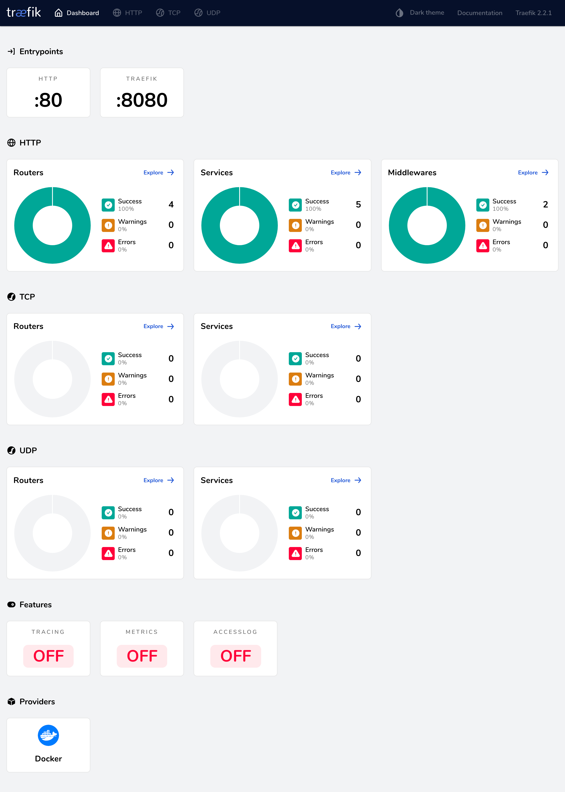
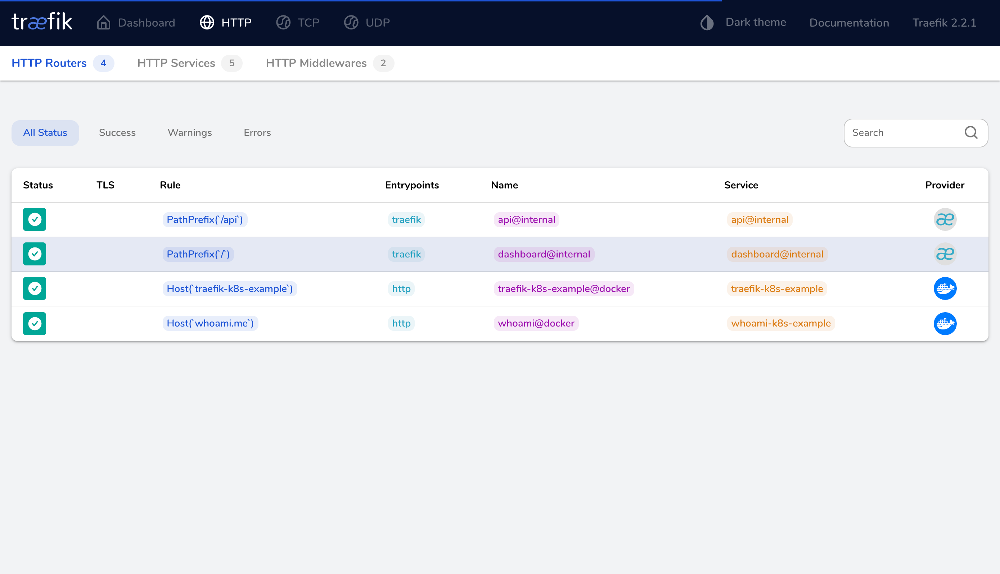

# traefik 快速入门

```yaml
version: '3.6'
services:
  traefik:
    image: traefik:2.2.1
    # Enables the web UI and tells Traefik to listen to docker
    # 启用 webUI 并告诉 Traefik 去监听docker的容器实例
    command: --api.insecure=true --providers.docker
    ports:
      # Traefik暴露的http端口
      - "80:80"
      # webUI暴露的端口(必须指定--api.insecure=true才可以访问)
      - "8080:8080"
    volumes:
      # 指定docker的sock文件来让traefik获取docker的事件，从而实现动态负载均衡
      - /var/run/docker.sock:/var/run/docker.sock
```

```bash
$ docker-compose -f traefik.yaml up
```

访问traefik管理面板 http://127.0.0.1:8080

部署应用，并使用traefik进行测试

```yaml
version: '3.6'
services:
  whoami:
    image: containous/whoami
    labels:
      - "traefik.http.routers.whoami.rule=Host(`whoami.me`)"
```

```bash
$ docker-compose -f whoami.yaml up
```

命令行测试访问

```bash
$ curl -H Host:whoami.me http://localhost
  Hostname: ed8c4aa14f3c
  IP: 127.0.0.1
  IP: 172.26.0.2
  RemoteAddr: 172.26.0.3:47906
  GET / HTTP/1.1
  Host: whoami.me
  User-Agent: curl/7.64.1
  Accept: */*
  Accept-Encoding: gzip
  X-Forwarded-For: 172.26.0.1
  X-Forwarded-Host: whoami.me
  X-Forwarded-Port: 80
  X-Forwarded-Proto: http
  X-Forwarded-Server: c1c0e9cba5a6
  X-Real-Ip: 172.26.0.1
```

切记`-H Host:whoami.me`参数，不加该参数是访问不到的。

```bash
$  curl -i http://localhost
  HTTP/1.1 404 Not Found
  Content-Type: text/plain; charset=utf-8
  X-Content-Type-Options: nosniff
  Date: Fri, 08 May 2020 06:31:27 GMT
  Content-Length: 19
  
  404 page not found
```

Traefik 可用的路由规则：

| **规则**                                                     | **描述**                                                     |
| ------------------------------------------------------------ | ------------------------------------------------------------ |
| Headers(`key`, `value`)                                      | 检查 headers 中是否有一个键为 key`值为`value`的键值对        |
| HeadersRegexp(`key`, `regexp`)                               | 检查 headers 中是否有一个键为 `key`，值匹配正则表达式 `regexp`的键值对 |
| Host(`example.com`, ...)                                     | 检查请求的域名是否包含在给定的 `domains` 域名中              |
| HostRegexp(`example.com`, `{subdomain:[a-z]+}.example.com`, ...) | 检查请求的域名是否匹配给定的 `regexp`正则表达式              |
| Method(`GET`, ...)                                           | 检查请求的方法是否包含在给定的 `methods (GET, POST, PUT, DELETE, PATCH)` 中 |
| Path(`/path`, `/articles/{cat:[a-z]+}/{id:[0-9]+}`, ...)     | 匹配确定的请求路径，它接受一系列文字和正则表达式路径         |
| PathPrefix(`/products/`, `/articles/{cat:[a-z]+}/{id:[0-9]+}`) | 匹配请求前缀路径，它接受一系列文字和正则表达式前缀路径       |
| Query(`foo=bar`, `bar=baz`)                                  | 匹配查询字符串参数，接受key=value的键值对序列                |

使用 docker-compose up --scale命令来对容器横向扩容，将单机扩容成2台：

```bash
$ docker-compose -f whoami.yaml up -d --scale whoami=2
Starting k8s-example_whoami_1 ... done
Creating k8s-example_whoami_2 ... done
```


此时再访问`curl -H Host:whoami.me http://localhost`就会自动负载均衡到2个不同的实例上去了。

```bash
$ curl -H Host:whoami.me http://localhost
  Hostname: 9052df7a5a4b
  IP: 127.0.0.1
  IP: 172.26.0.4
  RemoteAddr: 172.26.0.3:38558
  GET / HTTP/1.1
  Host: whoami.me
  User-Agent: curl/7.64.1
  Accept: */*
  Accept-Encoding: gzip
  X-Forwarded-For: 172.26.0.1
  X-Forwarded-Host: whoami.me
  X-Forwarded-Port: 80
  X-Forwarded-Proto: http
  X-Forwarded-Server: c1c0e9cba5a6
  X-Real-Ip: 172.26.0.1
```

```bash
$ curl -H Host:whoami.me http://localhost
  Hostname: ed8c4aa14f3c
  IP: 127.0.0.1
  IP: 172.26.0.2
  RemoteAddr: 172.26.0.3:51362
  GET / HTTP/1.1
  Host: whoami.me
  User-Agent: curl/7.64.1
  Accept: */*
  Accept-Encoding: gzip
  X-Forwarded-For: 172.26.0.1
  X-Forwarded-Host: whoami.me
  X-Forwarded-Port: 80
  X-Forwarded-Proto: http
  X-Forwarded-Server: c1c0e9cba5a6
  X-Real-Ip: 172.26.0.1
```

可见已具备负载均衡的能力，在`172.26.0.4`和`172.26.0.2`之间进行负载。